# CoinAutomation 项目背景与开发指南

### AL. 闭环 PnL 反思与多空对称质量守卫
- `daily long review` 不得只看事件级止损反思；必须结合最近闭环仓位统计（优先较长窗口，如 21 天）生成客观的胜率 / realized / net PnL / 多空分布 / 典型亏损样本摘要，并写入可供后续短线提示读取的结构化字段。
- 这类闭环 PnL 摘要是**客观反馈上下文**，不是具体交易指令；不得把它写成“看到 X 就买/卖”的教条计划。
- `execution/main.py` 的 entry quality 守卫必须保持多空对称：已有 `no chase-short into oversold extension`，后续不得再缺失 long 侧的 `first-bounce / weak reclaim / late extension` 追多拦截。

你是一名资深开发者，正在协助 **CoinAutomation** 项目。本文件作为你的记忆库和架构指南，旨在确保开发的连续性，并防止过去犯过的错误再次发生。

项目进程崩溃=执行失败
出现state_machine_error=执行失败

最高指示：修改代码后严禁执行代码！

## 1. 项目概述与目标
本项目旨在构建一个**完全自主的 AI 加密货币日内交易员**。它专注于 ETH/USDT 的日内技术形态、实时新闻和流动性变化，目标是在 24 小时窗口内捕捉价格波动，实现收益最大化。

## 2. 系统架构
项目采用模块化、事件驱动的架构：

- **策略层 ([strategy.py](file:///home/coinautomation/strategy.py))**：
    - 系统的“大脑”。
    - 编排来自各种协议（大鲸鱼警报、新闻、Polymarket）的数据采集。
    - **智能唤醒控制**：通过动态合并（P1 10s, P2 180s）和指标变化量阈值（RSI 5.0, 价格 0.5%, 风险率 0.05）来平衡决策频率与量化灵敏度。
    - 管理 LLM 决策循环，并将多个事件合并到单个上下文。
    - **直连门控数据**：Short Agent 直接读取经过 `FirstGate/SecondGate` 过滤后的高质量新闻与预测市场数据，不再依赖中间层长期视图。
- **执行层 ([execution/main.py](file:///home/coinautomation/execution/main.py))**：
    - 生产口径为 **同进程 LangChain Tools 模块**（不再依赖 FastMCP 作为生产入口）。
    - 向 LLM 开放 U 本位合约交易工具（下单、平仓、杠杆、保证金模式、挂单管理、账户查询）。
    - **核心组件**：`trade_usdt_futures`、`close_usdt_futures_position`、`get_usdt_futures_position/account/max_open_position`。
- **监控层 ([Binance/Binance.py](file:///home/coinautomation/Binance/Binance.py))**：
    - 处理实时市场数据抓取和指标计算（RSI、MACD 等）。
    - 生成账户报告和结构化警报。
- **知识库**：
    - `prompts/agentprompt.md`：交易 AI 的核心系统提示词。
    - `experience.md`：沉淀的交易智慧（教科书风格）。
    - `shortmemory.md`：**短期记忆与决策一致性**。记录当前计划、已接受的风险阈值，确保模型在连续 Turn 之间逻辑不打架。
    - **闹钟系统 (clock.json)**：具体的未来行动触发器，由工具 `set_alarm` 管理。时间参数必填；`condition` 为选填 JSON 条件。若填写 `condition`，语义为“在截止时间前若条件命中则立即触发，否则到期自动删除”。

## 3. 关键开发经验与教

### A. 防止负反馈循环
- **问题**：AI 曾将临时状态（如“余额低”）记录为 `experience.md` 中的长期“交易纪律”，导致陷入“恐慌循环”，即使挂单中资金充足也拒绝交易。
- **修复**：
    - 在 Agent Prompt 中强制执行**“无状态推理”**。
    - 严格定义 `experience.md` 为**通用知识库**，严禁记录当前日志或订单 ID。
    - **废除 `conditions.md`**：所有的短期任务（价格触发、规律验证）必须通过闹钟工具（`set_alarm`）实现。这强制模型在设置任务时必须考虑具体的时间点和唤醒 Prompt，而不是在文本文件中堆砌无用的持仓状态。
    - 明确区分“可用余额”与“总流动性”（可用 + 锁定 + 可借）。

### B. 执行前模拟与预览
- **问题**：AI 有时会在未完成合约账户核对的情况下直接开仓，导致可开仓位误判或保护单配置不完整。
- **修复**：
    - **开仓前审计**：AI 在任何新开仓前必须调用 `get_usdt_futures_position` + `get_usdt_futures_account` + `get_usdt_futures_max_open_position`。
    - **平仓前复核**：平仓前必须再次确认持仓方向与数量，并用 `close_usdt_futures_position` 执行方向一致的减仓/平仓。

### C. 理性的风险阈值
- **核心原则**：风险率只允许作为**唤醒与观测信号**，用于提醒模型重新审视清算距离、波动率和趋势强弱，**严禁**把“风险率低于某个数字就必须做什么”硬编码进策略、提示词或长期经验。
- **趋势优先**：若趋势、结构和清算距离仍然支持持仓，模型不得因为单一风险率数值而恐慌性止盈或抛售。
- **配置边界**：`Binance/Binance.py` 中可以保留风险率展示与告警，但不得把具体动作写死为规则引导模型执行。

### D. 动态趋势反转
- AI 必须具备**“快速翻仓”**能力。如果持有空单但市场情绪转向极度利多，不应死等止损，而应调用 `close_usdt_futures_position` 后立即反手做多。

### E. 调试与错误处理
- **问题**：LLM 返回的 JSON 格式偶尔不规范或包含多余字符，导致 `strategy.py` 解析失败，且难以定位原始错误数据。
- **修复**：
    - 在 `strategy.py` 中实现了 `safe_json_loads` 助手函数。
    - **核心守则**：任何位置的 JSON 解析失败，都**必须**捕获异常并打印完整的待解析字符串。严禁静默失败或仅输出错误摘要。
    - 对 `daily_long_review` / `long_horizon` 这类结构化 review 链路，日志目录必须保留**原始模型回包**与**解析诊断**；否则后续审计只能看到“invalid JSON”结论，无法定位是空回包、截断、代码块包裹还是非 dict 顶层。
    - `daily_long_review` 调度失败时，**不得**因为预先写入“今日已运行”而阻止同日重试；应允许冷却后再次调度，避免单次格式错误让整天的日审缺席。
    - 只要生产 `make_decision()` 已创建 `logs/<timestamp>/` 目录，后续即使发生未捕获异常或任务取消，也必须至少补写紧急版 `input.md` / `output.json`；空日志目录一律视为 bug，不是允许的中间状态。
    - 对任何由模型维护的结构化 JSON 文档（如 `long_reflection`、`daily_execution_reflection`、记忆文件），默认必须使用 **标准 JSON Patch (`add` / `remove` / `replace`) 增量更新**，禁止要求模型整份重写全文。
    - 若某条结构化链路因输出过长而触发截断/`invalid JSON`，**优先治本**：缩小输出合同、改为 patch、减少无变化字段复述；**不要**先靠调大 `max_tokens` 兜底。
    - **执行上下文刷新口径**：`compose_prompt` 生成的 `user_prompt` 只是本轮起点快照；进入 `execute_primary` / `execute_primary_retry` 时，必须再注入实时 `current_time`、`Pending Alarms`、短期记忆锚点和 deadline audit。若实时刷新与旧 prompt 快照冲突，始终以实时刷新为准。
    - **过期等待字段降噪**：加载运行期短期记忆或渲染 prompt 前，必须主动清理已经过期的 `day_plan.hold_until` / `day_plan.recheck_at`，避免模型把过期等待计划误当成 live plan 继续沿用，随后再被 `wait_deadline_stale` 拦截。

### F. 科学怀疑论与证伪逻辑
- **核心逻辑**：`experience.md` 中的条目不是绝对真理，而是**可证伪的假设**。
- **执行守则**：
    - 模型根据经验做出预测后，必须使用 `set_alarm` 设置验证点。
    - 如果预期结果未发生，必须分析原因并主动**删除或修改** `experience.md` 中的相关条目，防止教条主义。

### G. 杠杆与仓位管理
- **保证金模式用户偏好**：用户明确只做 `CROSSED`（全仓），后续默认按全仓语义审计与执行；不得再把“优先使用 `ISOLATED`”作为默认建议或校验前提。
- **浮盈加仓 (Pyramiding)**：在趋势确认且已有浮盈的情况下，可通过 `set_usdt_futures_leverage` + `get_usdt_futures_max_open_position` 逐步扩仓，并同步上移止损锁定风险。
- **入场前移**：允许采用“试探仓 + 确认加仓”框架，在突破前证据齐备时先用小仓位参与，突破确认后再扩至目标仓位，避免一味等待导致成交价抬高。
- **试探仓保护单豁免（用户偏好）**：试探仓按语义声明识别（模型需明确写出“试探仓/probe”），不再使用固定仓位阈值。满足该语义时可不立即挂止损止盈单，但必须同时满足：设置 3-10 分钟短闹钟、在 `state_change_evidence` 写明失效条件、闹钟轮优先复核且失效即平仓（`close_usdt_futures_position`）。
- **试探仓止损后的冷却豁免边界（用户偏好）**：试探仓止损后可豁免一次 `long` 方向冷却，但仅限该方向；若同向试探连续两次止损，必须恢复 `long` 冷却；在 `strong_bearish` 且反转证据不足时，仍禁止立即重试做多。
- **利润保护**：趋势后段优先通过基于结构与波动率的动态移动止损保护浮盈，而不是依赖固定风险率阈值触发离场。

### AZ. 密钥与环境变量统一口径（2026-07-22）
- 全项目只允许使用仓库根目录 `.env` 作为密钥与运行配置来源。
- 禁止再创建或读取 `Binance/.env`、`execution/.env`、`whale/**/.env` 等分散文件。
- 所有脚本通过 `env_config.load_project_env()` 加载；新增代码不得再调用 cwd 相对的 `load_dotenv()` 或硬编码 `/home/coinautomation/*.env`。
- 本地可参考 `.env.example` 复制为 `.env`；真实 `.env` 不得提交到 git。

## 4. 操作守则
- **批判性思考与防盲从 (Critical Thinking)**：作为 AI 助手，你必须保持独立的逻辑判断。用户（USER）的指令或假设也可能存在错误、过时或误导。
    - **双重校验**：在执行用户指令前，必须对照实时的市场数据和账户状态。如果发现用户指令与客观事实（如保证金逻辑、趋势信号）冲突，应在执行或建议中明确指出风险，而不是盲目顺从。
    - **逻辑溯源**：如果用户提出的观点与之前的系统规则冲突，优先遵循经过验证的金融逻辑和项目最高指示。
- **工具使用**：始终优先使用专用的策略执行工具（LangChain tools），而非手动的 CLI 命令。
- **提示词维护**：保持交易 AI 的语气专业且数据驱动。避免使用“恐慌”、“紧急”、“可怕”等情绪化词汇。
- **日志审计**：通过监控 `logs/` 目录来审计 AI 的“思考过程”与“执行结果”是否一致。
- **持续学习与自更新**：AI 助手在协助开发过程中，如果发现了新的稳定模式、系统缺陷或用户明确的偏好逻辑，**必须主动将其总结并更新到本文件 (`AGENTS.md`) 中**。这确保了跨会话的知识传递。

## 5. 未来任务
- 进一步精细化 RSI/MACD 背离模型。
- 增强新闻和 Polymarket 数据在决策中的权重。
- 实现基于波动率的动态“移动止损”逻辑。

### H. 前端可视化与时区处理
- **问题**：在开发交互式复盘工具 ([report.py](file:///home/coinautomation/report.py)) 时，Binance API 返回的 UTC 时间戳与用户本地北京时间（CST）以及日志文件夹名（CST）经常发生错位，导致事件标记偏移 8 小时。
- **修复**：
    - **全链路对齐**：在后端将 K 线数据强制增加 8 小时，伪造成“北京时间数值”的时间戳。
    - **墙上时间对齐**：日志文件夹名直接按数值转换为时间戳，不再进行时区转换。
    - **前端原样显示**：前端图表库关闭自动时区转换，直接显示收到的数值。这确保了横轴、十字准星、事件标记和弹窗时间在数值上大一比一完全对齐。
- **库版本经验**：Lightweight Charts v4.0+ 移除了 `addCandlestickSeries`，需改用 `addSeries(LightweightCharts.CandlestickSeries, ...)`。同时，Marker 的吸附需要严格的时间轴对齐或实现模糊匹配算法。

### I. 交易意图识别
- **问题**：简单的 `side` 判断会将多头止损/止盈触发单（保护性 SELL）或手动撤单误判为“主动卖出 (S)”，干扰复盘直觉。
- **修复**：在 [index.html](file:///home/coinautomation/templates/index.html) 渲染逻辑中增加工具类型识别。将 `cancel_all_coin_futures_orders`、`cancel_coin_futures_order` 以及包含 `STOP`/`TAKE_PROFIT` 关键字的触发单标记为专属的 **橙色“O”图标**，以区分即时成交的主动买卖。同时，初始化 side 识别逻辑，默认非买即卖的盲目判断改为基于工具意图的精准分类。

### J. 复盘工具 UI/UX 规范
- **多事件聚合**：由于模型激活频率可能高于 K 线周期（15m），复盘工具必须支持在同一时间点聚合显示多个事件。
- **分类标记标准**：
    - **B (绿色)**：做多入场。
    - **S (红色)**：做空入场。
    - **C (紫色)**：平仓离场。
    - **O (橙色)**：保护性挂单（止损、止盈、触发单）。
    - **N (灰色)**：仅观察，无交易行为（若同一周期有其他行为则自动去噪隐藏）。
- **依附式定位**：交易标记必须实时依附于 K 线实体的最低价（`low`），并随缩放/滚动动态重绘坐标。
- **分层折叠详情**：
    - 详情弹窗采用 **聚合视图**，按发生顺序排列该窗口内的所有模型激活。
    - 每一项日志细节（Execution, Explanation, Memory 等）必须封装在 **`<details>` 标签**中，且默认保持 **折叠状态**，以防止长文本导致的视觉过载。
    - 每个事件必须清晰标注其**原始北京时间时间戳**。

### K. 交易执行的原子性与精度管理
- **问题**：AI 在执行币本位触发单时经常出现方向与 `position_side`/`reduce_only` 不一致，导致保护单失效或误开反向仓。
- **修复**：
    - **触发单一致性验证**：`trade_coin_futures` 的保护单必须满足方向、`position_side`、`reduce_only` 三者一致。
    - **平仓前清理挂单**：必要时先 `cancel_all_coin_futures_orders` 释放保证金，再执行平仓动作。
    - **容量缓冲准则**：开仓与保护单都应在 `get_coin_futures_max_open_position` 基础上保留安全缓冲，避免边界失败。
    - **数值 ID 约束**：对 `order_id` 参数增加了 `isdigit()` 验证，严禁 AI 传递非数字字符串作为订单 ID。

### L. 市场执行与成交明细 (Fills)
- **问题**：用户反馈在币安成交历史中看到大量极小额（如 5.3 USDT，刚好略高于 minNotional）的买入记录“刷屏”，怀疑是多次下单。
- **事实**：经审计 `output.json` 和 `trade_history.csv`，模型仅发出了一笔 `trade_coin_futures` 市场单。多条成交记录共用同一个 `order_id`。
- **结论**：这属于交易所撮合引擎的执行表现（单一订单被拆分为多笔 Fills），而非代码重复下单。
- **优化建议**：在向用户展示交易结果时，应强调 `order_id` 的唯一性。如果未来需要优化日志，可在前端复盘工具中对同一 `order_id` 的成交明细进行聚合显示，以减少视觉干扰。

### M. 极端行情下的趋势识别与止损冷却
- **问题**：在 4 月 16 日的持续大跌中，AI 陷入“超卖即买入”的均值回归陷阱，忽略了宏观趋势的压制，并在止损后立即重新进场（抢反弹），导致连续亏损。
- **修复**：
    - **趋势环境过滤**：在 `agentprompt.md` 中强制引入“趋势环境识别” (Trend Regime)。在 1h/4h MACD 均为负且价格低于中轨的强空头趋势下，严禁仅凭 RSI 超卖入场，必须等待 15m/1h 级别的价格行为确认（如更高低点或 MACD 柱线收敛）。
    - **止损冷却机制**：强制执行“止损冷却期”，但**禁止在代码里硬编码固定 60 分钟**。冷却窗口必须由模型根据波动率写入 `shortmemory.md` 的 `Consistency State`（至少包含 `cooldown_direction` 与 `cooldown_until`），由 `strategy.py` / `fronttest/strategy.py` 负责校验一致性并阻止冷却期内的同向重入。
    - **假设证伪逻辑**：要求 AI 为每一笔“博反弹”交易设定“证伪时间/价格点”。如果预期反弹在 2 小时内未发生或跌破新低，必须立即主动止损，而非死守止损线。
    - **知识库清理**：当发现 `experience.md` 中存在“底部持仓耐心”等教条化错误经验时，应果断清空该文件，防止模型被错误的过往记录误导。
    - **双向能力要求**：在强空趋势下，AI 必须显式评估做空机会，不能长期退化为“只会做多 + 止损”的单边策略。

### AA. 一致性状态枚举化与假设等待上限
- **问题**：`shortmemory.md` 中的 `market_regime` / `trade_intent` 长期使用自由文本（如 `neutral_to_bearish_short_term`、`prepare_long_entry`），而策略门控只对少数关键词做弱匹配，导致“强空环境下反复等待后突然做多”这类行为难以稳定拦截。
- **修复**：
    - `Consistency State` 必须枚举化：`market_regime` 只允许 `strong_bullish` / `strong_bearish` / `neutral_sideways`；`entry_plan_direction` 只允许 `long` / `short` / `both` / `flat`；`hypothesis_status` 只允许 `active` / `verified` / `invalidated` / `blocked`。
    - 每个短期交易假设必须写入 `hypothesis_id`、`hypothesis_direction`、`hypothesis_expiry`；历史日志里的 `wait_count` 仅作兼容字段读取，不再赋予当前行为语义。
    - **假设连续性**：继续沿用同一 `hypothesis_id` 时必须补充新的 `state_change_evidence`；若证据不足，应保持 `blocked` 或结束该假设，禁止无限续闹钟拖延。
    - **强空义务**：在 `strong_bearish` 下，若不做空，必须在 `state_change_evidence` 中写明放弃做空的证据化原因；若要逆势做多，则必须提供价格行为/动能反转证据，不能只写“RSI 超卖”。

### AB. 一致性守卫与提示词口径对齐（Wait->Trade / 执行事实）
- **问题**：当上一轮 `shortterm` 结论是 `wait/flat` 时，模型可能直接调用 `trade_coin_futures`，但未在同回合提供 `state_change_evidence`，导致被守卫连续拦截重答。
- **修复口径**：
    - 若要从 `wait` 切换到开仓，必须在触发 `trade_coin_futures` 之前就在同一条 assistant 响应文本写出非空 `state_change_evidence`（价格行为/动能证据）。
    - 若收到 `consistency_break` 拒绝，禁止盲目重复同一开仓调用；必须先补齐证据与状态切换，或改为 `set_alarm` 等待验证。
    - **执行事实与成交关联规则**：
        - **挂单阶段**：调用工具（如 `trade_coin_futures`）后，仅表述为“已提交订单/已挂单（Submitted/Pending）”，严禁说“已成交/已平仓/已持仓”。
        - **成交阶段**：只有当 `get_coin_futures_position` 等审计工具确认变化后，才可表述为“已成交/已平仓/已持仓”。
        - **归因义务**：当发现之前挂的单子成交（Fills）时，**必须**在日志中明确指出：“这是之前在 [时间/回合] 基于 [决策理由] 挂下的订单已成交”。严禁将其视为无源的孤立事件，必须通过 `hypothesis_id` 或 `shortterm` 历史进行闭环归因。
- **交易容量工具口径**：统一使用 `get_coin_futures_max_open_position` 作为容量上限来源，禁止混用旧杠杆现货容量语义。

### AC. 预检查链路拆分与强空运行时门禁
- **问题**：执行层与提示词曾存在“开仓前检查项”口径不一致，导致模型误以为已完成前置检查；同时策略层主要依赖旧 `shortmemory` 做趋势门禁，容易被过时状态绕开。
- **修复口径**：
    - 开仓前置检查统一为：`get_coin_futures_position` + `get_coin_futures_account` + `get_coin_futures_max_open_position`。
    - 开仓调用前必须核对 `symbol` / `side` / `position_side` / `reduce_only`，禁止检查结果与实际下单方向不一致。
    - `strategy.py` 的强空门禁必须同时参考最新 `binance_data` 推断出的运行时趋势，不得只依赖磁盘中的旧 `shortmemory`。
    - 审计脚本 `gentestreport.py` 在遇到交易所客观执行阻断文本证据时，不应再把空仓等待误标为 `tactical_short_missed`。

### N. Fronttest 篡改可视化与人工闸门
- 前测默认使用历史原始行情，不再对 K 线进行篡改。
- `fronttest` 默认运行在“纯决策机”模式：关闭巨鲸监控、常规信号监控、fills 唤醒、alarm 轮询、heartbeat；仅保留手动触发入口和决策循环。
- 前测重构为“时间锚点回测”：启动时由用户输入北京时间锚点，市场上下文只允许使用该时间点之前可见的真实 K 线数据。
- `fronttest/Binance_backtest.py` 是 `Binance/Binance.py` 的复制修改版，专门提供 `protocol_at_time` 以支持历史截断后的指标生成。
- 前测持仓必须保留（非默认空仓），由控制台持仓预设写入 `fronttest/execution/sim_state.json`，用于模拟在持仓状态下的策略行为。

### O. Fronttest MCP 兼容与提示词口径
- `fronttest/strategy.py` 的 `call_llm_non_streaming` 必须显式接收并传入 `event_type`，避免一致性门控中出现 `NameError`（如 `event_type` 未定义）。
- 前测执行层 `fronttest/execution/main.py` 对模型可见的工具描述与返回字段，必须保持“生产口径”：禁止暴露 `simulated/simulated_only/[SIM]/fronttest` 等环境标签。
- 仅保留业务语义上的“预估/预览”字段（如风险预估），避免让模型因为环境标签而改变决策风格。

### P. Fronttest 时间穿越一致性
- 在 `fronttest` 的回测中，模型看到的 `{{current_time}}` 必须使用用户输入的锚点时间，而非系统当前时间。
- 注入到模型上下文的时间文本（事件、闹钟相关文本、Binance 报告、账户报告、新闻、Polymarket、短期记忆等）必须统一强制对齐到锚点年月日；允许用字符串替换年月日，确保模型“认知时间”一致。

### Q. Fronttest 历史日志回放（时间快放）
- 回放模式的数据源是**项目根目录** `logs/`（不是 `fronttest/logs`）。
- 输入回放起点时间后，必须读取该时间之后（含该时间）的首个 `input.md` 作为起始上下文，并按时间顺序回放到用户指定终点。
- 回放时必须使用“新提示词 + 旧上下文”策略：`system prompt` 使用当前 `agentprompt.md`（按 `# Autonomous Execution` 作为系统侧分界提取），`user prompt` 使用历史 `input.md` 的 `--- USER PROMPT ---` 以下原文。
- 时间快放过程中要保留并延续 `shortmemory.md` / `experience.md` 的演化，不在每步重置记忆。
- 启动交互顺序上，必须先询问是否启用回放模式；若启用则直接进入回放起止时间配置，跳过“回测锚点+持仓预设”流程。

### R. Fronttest 回放日志落盘结构
- 每次执行（普通前测或时间快放）都必须先创建执行根目录：`fronttest/logs/<执行时日期时间>`。
- 普通执行的每轮日志写入该执行根目录下的时间子目录（默认当前时间戳），包含 `input.md` 与 `output.json`。
- 时间快放时，子目录名称必须标记对应被快进的历史日志日期（如 `20260416_000053`），并在该子目录下写入当轮 `input.md` 与 `output.json`。

### S. Fronttest 快进推送策略
- 时间快放模式必须禁用 QQ 推送，防止历史回放期间刷屏。
- 普通前测模式可保留推送能力。

### T. Fronttest 记忆文件隔离
- `fronttest` 运行时必须使用 `fronttest/experience.md` 和 `fronttest/shortmemory.md`，不得读写项目根目录同名文件。
- 每次启动 `fronttest/strategy.py` 时，必须先创建并清空这两个 fronttest 记忆文件，然后允许模型在复盘/快进过程中自行写入。

### U. Fronttest 记忆快照落盘
- 每轮执行写日志时，在该轮日志目录内除 `input.md` 与 `output.json` 外，还必须落盘 `experience.md` 与 `shortmemory.md` 快照。
- 快照内容应为该轮执行完成后的最新记忆状态，便于逐轮审计长期/短期记忆演化。

### V. Fronttest 执行层小币安
- `fronttest/execution/main.py` 必须维护前测专属的“小币安”状态：价格、仓位、保证金资产、挂单、保护触发单、成交历史都由该执行层统一维护。
- 该执行层对模型暴露的工具口径必须保持生产风格，不向模型强调“模拟/仿真”环境标签。
- `fronttest/strategy.py` 在每轮决策前必须先把锚点对应的历史市场快照（时间与 OHLC）同步给执行层，再让模型调用工具；这样平仓预览、实际平仓、挂单/触发单撮合和盈亏分析都基于当时历史价。
- `fronttest/strategy.py` 本身是 MCP 客户端；`FastMCP` 服务定义在 `fronttest/execution/main.py`，并由 strategy 通过 stdio/SSE 拉起并连接。

### R. 任务管理动作的“执行一致性”硬校验
- **当前口径**：闹钟允许模型自主删增，不再因为文本里提到“设置/删除闹钟”而执行声明-调用一致性拦截。
- **保留项**：`final_validation_errors` 仍可用于记录其他真正有价值的最终校验失败（如 JSON 结构错误、止损后冷却状态缺失等），便于后续审计回溯。

### S. JSON 解析成本优先策略
- 当模型返回内容包含代码块或额外包裹文本时，优先使用低成本恢复，不立即要求模型重答。
- 解析顺序固定为：`直接解析` -> `显式识别并去掉 ```json``` / 通用 markdown 代码块后解析` -> `提取第一个 { 到最后一个 } 后解析`。
- 严禁使用会改变语义的 JSON 修补（如正则改引号）；恢复失败后才回注错误并要求重答。
- **日志降噪要求**：前两步/前三步“尝试性解析”失败属于预期路径，不应打印 `❌` 级别错误；仅当全部恢复路径都失败时，才打印完整原文和错误，避免误导运维判断。

### X. QQ 推送可观测性
- 每轮生产决策的 QQ 推送除执行总结外，还必须包含“校验与重答摘要”，至少覆盖：
    - `validation_status`
    - `reanswer_count`
    - `triggered_rules`
    - `rejected_tool_calls`
    - `final_validation_errors`
- 目标是让用户能直接从 QQ 判断：本轮是模型自己合规通过，还是被一致性门禁拦截后重答修正。

### W. Fronttest 回放稳固性
- `fronttest` 在时间快放模式下，必须复用同一个 execution MCP 会话，禁止在“同步历史市场快照”和“模型正式调用工具”两个阶段分别重复拉起 FastMCP 进程。
- 时间快放开始前，必须用首条历史 `input.md` 中的账户/挂单快照初始化 `fronttest/execution/sim_state.json`，避免执行层“小币安”与历史 `user prompt` 初始状态不一致。
- 该初始化只用于确定回放起点；进入快放循环后，后续仓位、保证金资产、挂单、成交应继续由执行层状态自行演化，不应每步都被历史日志重新覆盖。

### Z. MCP 调用错误专项审计技能
- 新增技能目录：`skills/mcp-error-audit`。
- 触发口径：当用户提出“审计某日期/时间后的 MCP 错误”时，优先使用该技能。
- 固定流程：
    - 先在项目根目录执行 `python error.py` 刷新 `errors.json`。
    - 仅分析用户给定时间边界之后（含边界）的错误。
    - 结合 `execution/main.py` 工具实现进行归因，明确区分：
        - 提示词/调用方式问题
        - MCP 实现问题
        - 交易所或环境限制问题
        - 证据不足
    - 输出可执行修复方案（提示词约束、实现修复点、运维检查项）。

### Y. 审计与提交规则
- **仅审计不提交**：如果当前工作只做审计分析、没有修改代码或文档，则**不要**生成 git commit message。
- **提交信息语言**：只要本轮发生了代码或文档修改，最终必须提供 git commit message，且**必须使用中文**。
- **审计增强**：`gentestreport.py` 与 `fronttest/gentestreport.py` 的报告必须展示每次决策相较上一轮的 `experience` / `shortterm` 差异；禁止生成任何“预期/未来展望”文件。
- **技能同步要求**：任何 `skills/` 目录下技能的新建或修改，必须同步到 Codex 官方技能目录 `/root/.codex/skills/`，确保后续会话可以读取到最新版本。
- **本次技能同步预期审计效果**：后续审计时，技能版本应与仓库版本一致；审计输出不应再因读取旧版技能而缺失“记忆差异”章节。

### AJ. 条件闹钟与计划格式
- `set_alarm` 的统一口径为：`value/unit/prompt` 必填，`condition` 选填。
- `condition` 必须使用标准 JSON。
  - 单条件口径：`metric` + `operator` + `value`。
  - 复合条件口径：`{"expr":"(MACD>123&RSI<12)|price<12"}`，支持 `&`、`|`、括号与 `> < >= <=`。
- 提示词与计划书仍应优先输出规范的 `&` / `|`；但运行时解析器应兼容大小写 `and` / `or` 并先归一化为 `&` / `|`，避免模型只因连接词写法不同而被工具层阻断。
- 白名单指标首版优先支持 `price`、`price_1h`、`RSI`、`RSI_15m`、`RSI_1h`、`MACD`、`MACD_HISTO`、`MACD_HISTO_15m`、`MACD_HISTO_1h`。
- 若闹钟本质是在验证“某个指标是否大于/小于阈值”，必须优先考虑填写 `condition`，不要只在自然语言 prompt 里描述阈值。
- 旧版闹钟迁移到现代 `condition` 语义时，必须由开发者手动阅读 `clock.json` 后手动迁移；禁止新增运行时代码去自动猜测和批量迁移历史闹钟。
- 写计划时默认使用简洁固定格式：`摘要` / `关键修改` / `接口与类型变更` / `测试场景` / `假设`。
- 计划里的每一个修改点，都必须附带本轮沟通过的对应原文，方便快速对照。

### AD. 审计预期文件禁用口径（2026-04-24）
- **核心规则**：严禁使用任何“预期文件/未来展望文件”（包括但不限于 `backtest/outlook/*.md`）。这些文件一律视为无效信息源。
- **审计流程**：审计仅基于真实产物与客观证据（`backtest_report.txt`、日志、工具调用轨迹、账户与持仓事实），不得再读取“上一份预期”做对照。
- **生成约束**：无论是纯审计还是修复实现，均禁止新建、覆盖、更新任何预期文件。
- **报告口径**：审计报告中不再包含“预期对照/展望验证/PASS-FAIL for outlook”章节，改为直接输出“事实缺陷、影响、修复建议、下次观察点”。

### AI. `gentestreport.py` 报告结构口径（2026-04-26）
- `backtest_report.txt` 固定为三个一级标题部分：
  1. `# 行情与决策`
  2. `# 被挡下 / API 报错记录`
  3. `# Consistency State Timeline / Hypothesis Timeline`
- 第二部分必须使用与本次 `gentestreport.py <start> <end>` 相同的时间范围，汇总：
  - guard 拦截
  - API / tool 报错
  - 交易所拒绝
  - final validation 错误
  - retry 后已修复的中间失败（需标注 `resolved_on_retry`）
- 对 `missing_structured_wait_alarm`、`historical_alarm_confused_as_live` 这类文本语义拦截，必须展示触发文本摘录，供后续模型审核“挡得是否正确”。
- 第三部分必须结构化展示 `Consistency State` 与 `active_hypothesis` 的逐轮演化，不再要求审计者从 `Memory Diff` 中手工拼装状态时间线。

### AM. Guard 方向识别与已执行副作用一致性（2026-05-06）
- **问题 1：减仓/保护单被开仓质量守卫误判**
  - 在 U 本位双向模式下，`SELL + position_side=LONG` 与 `BUY + position_side=SHORT` 可能是**减仓/保护**，不能仅凭 `position_side` 就当成新的 long/short entry。
  - `execution/main.py` 的 entry-quality guard 必须先区分“开仓方向”与“减仓/保护方向”；否则会把 `close_long` / protective stop 误伤成 `long_entry_quality_violation` 或 `short_entry_quality_violation`。
- **问题 2：primary 已有副作用后，retry 不得继续下单补单**
  - 只要 `execute_primary` 本轮已经成功提交了任何**非闹钟类**副作用（如下单、减仓、保护单、撤单、杠杆/保证金调整、range plan 变更），后续 retry 必须切换为 **decision-repair only**。
  - 这时 retry 只允许修复合同、记忆和轻量校验，禁止再提交新的交易/保护/撤单动作，否则容易出现重复保护单、重复减仓或“上一手已成交但下一手又补一遍”的状态漂移。
- **问题 3：`guards_blocked_wait_next_turn` 不得伪装成“未执行任何动作”**
  - 若本轮在最终 guard block 之前已经成功提交副作用，最终 `output.json` 的 `execution_txt` 必须明确写出“**最终被 guard 拦下，但此前已执行部分动作，最终状态以 verify 为准**”。
  - 严禁继续统一写成“未执行新的下单、保护单或闹钟动作”，否则会与 `verify`、`tool_calls` 和真实账户状态冲突。
- **问题 4：guard-blocked 的记忆修复不能只留最小字段**
  - 当 guard block 发生前已经执行了真实风险动作（如减仓、补止损），`guard_blocked_repair_only` 允许写回的 `short_memory` 路径必须覆盖必要的执行一致性字段，例如：
    - `intraday_mode` / `execution_mode` / `wakeup_role`
    - `day_plan` 的 `day_thesis` / `day_invalidation` / `hold_until` / `recheck_at`
    - `risk_action_taken` / `risk_state`
  - 否则下一轮会继续读到陈旧的 `observe_only`、`risk_action_taken=none`，形成连锁不一致。
- **问题 5：账户/挂单快照不能漏掉 conditional 保护单**
  - 注入到 `input.md` 的账户与挂单视图，必须覆盖 **普通 open orders + conditional/algo 保护单**；不能再把 `closePosition` 类止损单漏掉后错误写成 `open_orders=[] / No open futures orders`。
  - `get_usdt_futures_open_orders`、账户报告 `Binance/account.md`、以及依赖这些快照的策略判断，必须以“全量订单视图”为准，而不是只看普通委托簿。
- **问题 6：同次 invoke 内已自修复的工具错误不能被外层 retry 误放大**
  - 若模型在同一个 `execute_primary` 调用里，先触发一个 `retryable` 参数/形态错误，随后又用**等价目标**的后续工具调用成功修正，外层 guard / retry 统计不得再把前一个 rejected call 当成未解决失败。
  - 审计上仍需保留原始 tool trace；但行为判定要区分“attempt 内自修复”与“attempt 末仍未修复”。

experience.md 是模型自己总结的，不是我写的，所以有可能出现错误。默认要谨慎对待长期记忆，不要把短期行情和临时计划直接写进去。

从 2026-04-18 起，我授权 Codex 在**有明确一致性修复、审计纠偏或提示词升级需要时**，可以直接修改 `shortmemory.md` 和 `experience.md`；不再限制为只能清空长期记忆。
- 但要求仍然是：修改要服务于“减少错误决策”或“让记忆与当前系统规则对齐”，不能随意润色。
- 若只是单轮行情噪声，不要把它包装成长期规律；优先改 `shortmemory.md`，长期规律保持克制。

### AE. 根因修复优先（禁用 fallback）
- 从 2026-04-19 起，处理执行错误时禁止使用 fallback 方案来“绕过”或“掩盖”问题。
- 必须直接定位并修复根因（提示词约束、门禁逻辑或执行实现），并给出可验证的修复证据。
- 对交易所客观限制（如 `-3045`）要明确标注为阻断状态并停止重试，不得包装成“已解决”。

### AF. U 本位开仓容量语义与方向约束
- U 本位合约不使用杠杆现货借贷语义；统一通过 `trade_usdt_futures` 的 `side` + `position_side` + `reduce_only` 表达开平仓。
- 账户容量评估以 `get_usdt_futures_max_open_position` 为准；`USDT` 现货余额与 U 本位保证金资产容量不是同一语义。
- 若出现交易所侧客观阻断（容量为 0、下单返回交易所阻断错误），应标注为 `blocked` 并停止盲目重试，转入等待/改计划决策。

### AK. 记忆文件 JSON 化口径
- 当前权威记忆文件为 `mem/short.json` 与 `mem/long.json`；旧 `shortmemory.md` / `experience.md` 仅用于历史兼容与一次性迁移，不再作为主读写入口。
- 模型对记忆的修改必须通过结构化 JSON patch 语义进行（`add` / `remove` / `replace`），禁止再输出整段 Markdown 全文覆盖记忆文件。
- `mem/short.json` 承载短期一致性状态、day plan、active hypothesis、risk/mtf 状态、narrative tracking 与 tactical alerts。
- `mem/long.json` 承载长期 validated rules、invalidated rules 与 operator notes；长期记忆保持克制，禁止把短期行情计划写入其中。
- 路径口径固定：`state_change_evidence` / `reversal_checklist` / `risk_trigger_evidence` 必须位于 `risk_state`。合法路径分别为 `/risk_state/state_change_evidence`、`/risk_state/reversal_checklist`、`/risk_state/risk_trigger_evidence`；禁止写到 `/consistency_state/*`。

### AM. Range Automation 语义与展示一致性
- `set_range_plan` 当前默认执行风格是 `trigger_market_v1`：执行层只会把区间计划写入 `mem/range_plan.json`，并在价格触达阈值时由本地执行器发出 `MARKET` 单；**不会**在启动瞬间就向 Binance 挂出双向限价委托。
- 因此，出现“active range plan”与 `get_usdt_futures_open_orders=[]` / Binance「当前委托(0)」并存时，默认应解释为“计划已武装、但尚未触发真实委托”，而不是交易所丢单。
- 提示词、日志、复盘文案、QQ 推送必须区分：
  - `active range plan / armed levels`：本地区间自动化待触发。
  - `live open orders / order_id present`：交易所上真实存在的委托。
- 在没有真实 `order_id` 前，禁止使用“已挂多单 / 已挂空单 / 已部署双向网格委托”这类表述；应改为“已启动区间自动化计划，long/short 触发位已武装”。
- 若 active range plan 的某一侧 level 已 `filled` 并形成 live 持仓，则 `mem/short.json` 必须立即把 `consistency_state.trade_intent` 与 `active_hypothesis.direction` 同步到 live side；禁止保留 fill 前的 `long_bias/short_bias` 旧值。
- `suppress_order_fill_wakeup=true` 是当前区间自动化的默认口径：已跟踪的区间 entry/exit fills 可以由执行层内部消化，不必每次都唤醒短期 agent；因此“发生过区间成交但没有 `order_fill` 日志”本身不构成异常。
- 但计划过期 / 突破不能被同样静默处理：`maintain_range_plan()` 必须先按 `status=active` 进入维护，再在内部检查 `expires_at` / breakout；禁止先用“未过期才算 active”的 helper 把过期计划提前判成 inactive，否则会出现“计划已过期但没有 `range_plan_expired` 唤醒、文件里仍残留 active 状态”的静默死计划。

### AN. report.py 缓存版本联动要求
- `report.py` 的可视化数据接口 `/api/data` 带有文件缓存，缓存键包含 `CACHE_VERSION`。
- **硬规则**：凡是修改 `report.py` 中任何会影响前端展示结果、统计口径、range 可视化、operations 解析、指标输出或 API 返回结构的逻辑时，必须同步修改 `CACHE_VERSION`，避免页面继续命中旧缓存而显示过期结果。
- 若本轮修改了 `report.py` 但未提升缓存版本，视为不完整修复。

### AO. Guard 自纠与工具说明口径（2026-05-05）
- **问题**：2026-05-05 03:13:45 至 11:57:49 复盘中出现同类 guard 连续重答至 12 次，典型为 `hypothesis_rollover_expiry_invalid` 只给英文字段提示，模型无法定位旧 expiry、新 expiry 和应该 patch 的精确路径；另有 `approved_contract_runtime_mismatch` 暴露出 runtime 调用了未在 `tool_intents` 批准的副作用工具。
- **修复口径**：
    - 所有 strategy guard / runtime tool guard 的拒绝结果必须包含面向模型的自然语言纠错指南，至少说明：为什么拒绝、应该改哪个字段/参数/调用顺序、是否允许本轮重试、若不允许应转为什么状态。
    - `[GUARD FEEDBACK]` 必须优先展示 `natural_language_guide` 与 rejected tool call 明细，避免模型只看到抽象 `error_class` 后盲目重答。
    - 对同一条 contract draft 在本轮已可检测出的多个失败（例如 `hypothesis_rollover_expiry_invalid` 与 `missing_structured_wait_alarm`）必须一次性回注给模型；禁止继续维持“只报一个 guard、下一次再报另一个”的打地鼠反馈。
    - 同一个 guard 连续失败应有短路保护，防止再次刷满硬重答上限；短路后应转入 blocked/wait，并保留完整失败原因供下一轮修复。
    - 若同一 `hypothesis_id` 的 expiry 没有实际变晚，则应把 `hypothesis_action` 规范为 `keep`；不得把“未延长 expiry 的继续观察”继续写成 `rollover`。
    - 若 execute/retry 真正落地时，原先引用的 `breakout_watch.confirm_deadline_at`、`hold_until`、`recheck_at` 或 `hypothesis_expiry` 已经落后于 `now`，则必须把它视为**deadline drift**，不能继续原样写回最终 snapshot；必须刷新 live facts 后直接下结论，或改写为真正未来的新窗口。
    - retry runtime refresh 不得只刷新 `open_orders/pending_alarms`；遇到短窗口等待场景时，必须同时暴露当前时间与 live range/breakout deadline 漂移信息，避免模型继续沿用旧确认时点。
    - `tool_intents` 是副作用工具批准合同：交易、平仓、撤单、改单、划转、杠杆/保证金、闹钟、range plan 等副作用工具必须先在 contract draft 中声明同名 tool 与 purpose，runtime 不得临时新增未批准副作用工具。
    - 每次工具调用都应有工具层面的 `explanation`（工具签名支持时必须提供），用于说明该工具是在验证哪个事实、执行哪个风险动作或服务哪个假设；这不同于最终 `explanation` 总结。
    - 读工具说明必须清楚标注“只读证据来源”，动作工具说明必须清楚标注“会改变账户/订单/计划状态”及相关 guard；避免模型把本地区间计划、交易所真实挂单、账户容量和历史记忆混为一谈。

### AG. 提示词-校验规则统一性（防重答硬约束）
- 根因原则：凡是 `strategy.py` 的一致性校验（final validation）或运行时守卫（tool-call guard）新增/修改了规则，**同一轮提交**必须同步更新 `agentprompt.md`；禁止“只改校验不改提示词”。
- 字面契约：提示词中的枚举值、关键词、字段名、时间格式必须与校验器可解析口径一致。尤其是：
  - `trade_intent` 只允许：`wait` / `long_bias` / `short_bias` / `cooldown`。
  - `entry_plan_direction` 只允许：`long` / `short` / `both` / `flat`。
  - `hypothesis_status` 只允许：`active` / `verified` / `invalidated` / `blocked`。
  - `strong_bearish` 下若不做空，必须在 `state_change_evidence`（或 `cooldown_reason` / `reversal_checklist`）包含“放弃做空/不做空/short blocked”等可识别短语，不能只写同义改写。
  - `strong_bearish` 下逆势开多必须满足“至少两项字面可识别反转证据词”；`MACD 翻正` 与 `MACD 转正` 视为同义，但仍需与另一项证据组合，不能单独放行。
- 字段落点规则：禁止把关键合规理由只写到校验器不读取的自定义字段中（例如仅写 `short_plan_blocked_reason`）。关键证据必须落在校验器读取字段：`state_change_evidence` / `reversal_checklist` / `cooldown_reason`。
- 开仓前硬门禁口径：若新增/强化 `trade_coin_futures` 的前置检查，提示词必须同步写明“同一次唤醒决策流程中，先完成 `get_coin_futures_position` + `get_coin_futures_account` + `get_coin_futures_max_open_position`，再开仓；缺一不可（允许前一批次完成）”，用于降低无意义重答。
- `neutral_sideways` / 横盘等待口径：当 live state 显示 `flat + clean_open_orders + no active range plan` 时，prompt 应向模型显式暴露“当前可启动 range automation”的能力状态，帮助模型在“纯等待”与“先做区间收租”之间自行决策；不要仅靠隐式字段让模型自己猜。
- U 本位 `range automation` 现已要求同时兼容 `hedge mode` 与 `one-way mode`；提示词必须明确告诉模型：在 `one-way mode` 下执行层会自动使用 `position_side=BOTH`，模型只需要定义区间边界、inside-band levels、expiry 与理由。
- `range automation` 的生产执行架构已升级为 `range.py` 驱动的 **trigger-based local executor**：模型继续定义 `hard_bounds` / inside-band levels / expiry，但 entry/exit 由本地价格监控在触发位执行市场单。提示词必须明确写出：不要为了修复 Post-Only/GTX 拒绝而把 levels 改离原本的结构位置。
- 若同一方向 hypothesis 在 `neutral_sideways` 中连续多轮保持 `blocked`，提示词应允许模型把“继续等剧烈突破”降级为可选项，并把 `set_range_plan` 作为“等待窗口内的被动 harvesting”路径显式暴露出来。
- 为了避免模型只记住“range 可以用”却不知道“当前区间怎么写”，prompt 应优先注入结构化的 `Sideways Range Opportunity Snapshot`：至少包含候选 breakout bounds、inside-band level skeleton、expiry 与当前价格在区间中的位置；该块是执行脚手架，不是强制动作，也不应通过文本语义正则来硬拦截模型。
- 上述 `Sideways Range Opportunity Snapshot` 不应只反映“当前距离上下边界多近”；还应显式总结最近一段 15m 箱体质量，例如 oscillation score、上下沿触碰次数、中轴往返次数，并给出 `suggested_range_mode`（如 `symmetric` / `short_only` / `long_only` / `low_confidence`）。目标是让模型按“最近整段行情是否成熟震荡”来决定，而不是机械地因为贴近边界就拒绝启动 range。
- 进一步地，snapshot 应把区间显式拆成双层：`hard_bounds`（外层失效/突破边界）与 `working_band`（内层实际挂单区间），并补充 `quartile_levels` 与 `suggested_buffer_pct`。目标是让模型学会“担心边界假突破时先放宽 breakout 边界，再继续在内层四分位做自动买卖”，而不是只有“中部才能做 range”的僵化理解。
- `range automation` 的 breakout 退出不应再是“第一次刺穿 hard_bounds 就立刻失效”。执行层应支持 `breakout_watch` 两阶段确认：首次触边先暂停新的 entry 挂单并进入确认窗口；若价格回到箱体内，视为假突破并继续 range；若持续外扩或超时仍在区间外，才确认真突破并退出。
- 若 `recent_range_quality` 已足够强且 `suggested_range_mode` 明确可执行，则不应再允许模型仅用 `price_too_close_to_band_edge` 作为拒绝理由；此时要么启动对应模式，要么给出更强的结构化拒绝原因（例如事件风险、levels 质量不足、方向性 setup 即将触发）。
- 当收到 `range_breakout_watch` / `range_breakout_reverted` 一类 range 监控事件时，提示词必须明确教会模型在三种解释里做选择：`false_breakout`、`true_breakout`、`box_too_tight`。若重复出现假突破，模型应优先考虑重新定义更宽的 `hard_bounds` / `working_band`，而不是把第一次刺边误当成箱体死亡。
- 若运行时满足 `execution_mode=observe_only` + `market_regime=neutral_sideways` + `eligible_to_start_range_plan_now=yes` + `active_range_plan=no` + `Sideways Range Opportunity Snapshot available`，可以启用**结构化 range 决策门禁**：模型必须在 `range_decision=start|decline` 中二选一；若 `decline`，必须提供结构化 `range_decision_reason_code`。该门禁允许显式拒绝 range，但禁止无解释地继续 observe。
- 若模型在同一 wakeup 内已经选择 `range_decision=start`，但第一次执行因 `memory_patch_invalid` / `hypothesis_rollover_expiry_invalid` / `declared_trigger_window_not_persisted` 一类**合同错误**被拦截，重答阶段应优先修合同并保留原经济决策；禁止因为第一次 range 尝试失败就退回惯性的 `observe_only`。
- `Sideways Range Opportunity Snapshot` 应显式给出 `range_start_contract_hint`：至少覆盖 `action_intent=manage_orders`、`execution_mode=managed_execution`、`intraday_mode=manage`，并解释 hypothesis expiry 与 range expires_at 不必强绑；若 range expires 更短，通常应 `keep` hypothesis，而不是错误地把 hypothesis expiry 改短后触发 `hypothesis_rollover_expiry_invalid`。
- 若 snapshot 已显示 `range_activation_bias=strong` 且 `suggested_range_mode` 可执行，系统应提高模型对 sideways harvesting 的胆量：不得再轻易用 `price_too_close_to_band_edge` 或 `range_levels_low_confidence` 作为默认拒绝理由。
- 若运行时已显示 `preferred_range_action=start_preferred`，问题就不应只在最终校验阶段暴露。prompt / precheck 应额外注入显式的 `Sideways Range Proposal Priority`，把“本轮先比较纯等待 vs range harvesting”前置到 propose 阶段，并明确 `mem/short.json` 的旧 `wait/observe_only` 状态只是 continuity，不是 veto。
- 提交流程要求：涉及 `strategy.py` 或 `agentprompt.md` 的改动，提交前必须人工对照一次“触发规则清单 vs 提示词条款清单”，目标是把可预见重答降到最低，避免出现连续 8 次 `final_validation_retry`。

### AH. 一致性门禁批次熔断与审计解释
- 当 `strategy.py` 在同一轮工具批次内命中任一开仓相关一致性门禁（如 `futures_precheck_missing` / `consistency_break`）时，必须**中止该批次剩余工具调用**，禁止继续执行后续挂单/撤单，防止“挂单-撤单-重挂”乒乓循环。
- 门禁拒绝回注给模型时，优先使用结构化字段（至少包含 `tag` / `reason` / `next_action`），避免仅返回自然语言错误导致模型误判可继续执行。
- 执行层交易工具建议支持可选 `explanation` 参数并写入交易日志，便于审计区分：策略判断问题、门禁冲突问题、或交易所客观阻断问题。

### AI. 记忆与反思体系 (Long & Short Memory)
- 系统采用“长短期结合”的记忆架构，确保交易员具备跨周期的规划能力与经验沉淀。
- **短期记忆 (`mem/short.json`)**：
    - 记录当前交易计划、活跃假设（Hypothesis）、风险状态和“最近决策片段”。
    - 确保单次决策过程中的上下文一致性。
- **长期反思与经验 (`mem/long_reflection.json` & `mem/long.json`)**：
    - **长期假设库**：记录已验证或已证伪的市场规律，作为交易的“教科书”。
    - **Daily Review**：每日北京时间 `08:10` 运行，负责将近期的执行表现转化为长期经验，更新 `long_reflection.json`。
- **止损反思 (`mem/post_stop_reflection.json`)**：
    - 记录止损因果链，防止连续犯错。
- **直连门控数据**：短期 Agent 直接读取 `news/gated.json` 和 `polymarket/gated.json`，在长期经验的指导下进行实时分析。

### AI-1. 架构演进与产物流向（2026-05-03 重构）
- **Agent 1: News & Polymarket Gated Models（双层门控模型）**
  - **FirstGate（相关性准入）**：当增量数据抵达时立刻触发。判断信息是否对 ETH 有影响。
    - 输出：`news/gated.json`、`polymarket/gated.json`，并保留增量日志到 `firstgate/` 目录。
  - **SecondGate（时效性清洗）**：每 3 小时运行一次。清除已经过时、衰减或结算的陈旧信息。
    - 输出：覆写 `news/gated.json`、`polymarket/gated.json`，并保留清洗日志到 `secondgate/` 目录。
- **Agent 2: Short Execution Agent（短期执行交易员）**
  - 输入：`news_gated.json`、`polymarket_gated.json`（直接作为战略锚点）、`mem/short.json`、账户与行情。
  - 输出：交易工具调用、`mem/short.json` JSON patch、交易执行日志。
  - 变化：不再依赖中间合成的 `long_horizon_view.json`，而是直接读取过滤后的高质量信息源。
- **Agent 3: Daily Review Agent（日度复盘）**
  - 输入：`news/gated.json`、近期执行日志。
  - 输出：`mem/long_reflection.json`（长期假设维护）、`mem/daily_execution_reflection.json`。
  - 日志：统一落盘到 `dailylog/` 目录下。
- **审计落地口径**
  - 人工审计主文件：`logs/<ts>/output.json`（结构化决策/门禁/重答）与同目录 `input.md`。
  - `gentestreport.py` 必须识别 `daily_long_review` 事件，输出 `daily_review_started` / `daily_review_completed` / `daily_review_failed`。
  - 报告优先使用本地结构化字段：`attempts`、`guard_failures`、`triggered_rules_first_fail/all_fail/final`、`resolved_rules`，LangSmith 仅作补充链路。
  - 若审计报告（如 `backtest_report.md` / `backtest_report.txt` / `gentestreport.py` 输出）与原始日志在时间范围、事件归属、成功/失败状态上出现不一致，**优先使用 MCP 锚定日志时间目录**，再回看 `logs/<ts>/output.json` 与 `input.md` 做结论；禁止只依据报告头部时间范围或二次汇总文本下判断。

### AR. 职责边界与价格建议禁区（2026-05-03 重构）
- **长线门控职责**：`FirstGate` 与 `SecondGate` 模型只负责对外部信息进行客观的“准入”和“淘汰”，维护一个高质量的宏观背景池。
- **短期层职责**：所有具体方向判断和价格规划都由短期执行 agent 基于当轮 `4h/1h/15m` 结构以及 `news_gated`、`polymarket_gated` 自行生成，包括入场区、突破位、回踩区、止损/止盈、触发阈值与闹钟条件。
- **门控层禁区**：门控模型的输出不得包含任何具体价格建议，例如“2300-2350 接多”“跌破 2280 做空”“站回 2400 追多”这类数值执行地图。它们只能说明“为什么这个新闻重要”。
- **允许的表达**：可以写“增加了避险需求”“提升了 ETF 资金流入预期”等逻辑传导链。
- **数据流说明**：
  - `gated.json` 会直接注入短期 prompt，属于短期 agent 的长期背景锚点。
  - `daily review agent` 不直接写短期记忆文件，但其反思内容会在短期 prompt 中出现。

### AQ. 系统检查清单（排障基线）
- **强制流程**：以后排查系统问题时，必须先按本清单逐项检查；若发现新的稳定故障模式、遗漏项或更高效的排查顺序，必须同步更新本清单与相关条目，避免下次重复踩坑。
- **1. 数据源检查**：
  - 新闻源文件是否可读、是否有新条目、时间字段是否正常。
  - `polymarket/monitor.json` 是否可读、`sub_markets/history` 结构是否符合当前解析口径。
  - `Binance/metrics_report.md` 是否包含日线、12 小时、4 小时、1 小时、15 分钟区块，且时间轴没有错位。
- **2. 长期层检查**：
  - `mem/long_pipeline/raw_long_inputs.json` 是否包含本轮预期的新闻、Polymarket 与 `price_context`。
  - `source_signature` 是否按预期变化；若不变化，是否真的是上游无新增长期信息。
  - `kept_long_inputs.json` / `dropped_long_inputs.json` 每条是否都有非空 `why`。
  - `long_reflection.json` 是否存在并可读；`active_hypotheses` / `invalidated_hypotheses` / `news_case_log` 是否结构完整。
  - 若长期层复用旧快照或失败回退，短期层是否明确知道自己读到的是旧结论。
- **2.1 Daily Review 检查**：
  - `mem/long_pipeline/long_review_state.json` 是否记录了最近一次 daily review 的日期、状态、错误与日志目录。
  - `daily review agent` 是否只更新 `mem/long_reflection.json`，而没有误写短期记忆或交易执行链路。
  - 报告与前端是否能看到最近一次 daily review 的保留/推翻/新增假设摘要。
  - 启动静态完整性检查必须覆盖 daily review 专用 helper（至少包括响应文本提取这类方法）；禁止让 `_extract_chat_message_text` 这类缺失只在定时触发时才暴露成 `AttributeError`。
- **3. 短期层检查**：
  - 短期 prompt 是否只以 `news/gated.json` 和 `polymarket/gated.json` 作为长期输入，而不是重新消费原始日线/12h。
  - `mem/short.json` 的 `market_regime` / `trade_intent` / `entry_plan_direction` 是否与长期方向约束和最新市场结构一致。
  - 若出现逆势交易，是否在 `state_change_evidence` / `reversal_checklist` 中给出足够证据。
- **4. 门禁与提示词一致性检查**：
  - 新增或修改了任何运行时门禁/最终校验后，是否同步更新 `agentprompt.md`。
  - 守卫拒绝是否带结构化字段，且不会把模型引导到重复犯同一个错误。
  - 长期层约束是否真正进入短期层上下文与审计链路；当前口径是不做“方向一致性”文本硬门禁，只记录逆长期偏好执行的结构化审计字段。
- **5. 执行层检查**：
  - 开仓前是否完成 `get_coin_futures_position` + `get_coin_futures_account` + `get_coin_futures_max_open_position`。
  - 保护单方向、`position_side`、`reduce_only`、`close_position` 语义是否一致。
  - 发生交易所客观阻断时，系统是否明确标记为阻断并停止盲目重试。
- **6. 日志与报告检查**：
  - 每轮 `logs/<timestamp>/` 是否同时有 `input.md`、`output.json`、`context/*.json`。
  - `gentestreport.py` 与 `report.py` 是否优先读取结构化 `context/*.json`，缺失时才回退 legacy 路径。
  - 审计报告是否能区分：长期门控错误、短期执行错误、门禁冲突、交易所阻断、纯观察轮。
- **7. 记忆检查**：
  - `mem/short.json` 是否仍承担短期一致性状态；`mem/long.json` 是否保持克制，没有混入短期计划。
  - 若修复涉及长期/短期记忆口径变更，是否同步更新提示词、门禁和审计展示。

### AJ. 保护单替换顺序与 `close_position` 语义修复
- `trade_coin_futures` 中 `close_position=true` 或 `reduce_only=true` 的 `STOP_MARKET` / `TAKE_PROFIT_MARKET` / `TRAILING_*`，必须一律视为**保护性减仓/平仓语义**，不得被一致性门禁误判为“新开仓”。
- 对于仍有活跃持仓的场景，**旧保护单是最后一道已验证保护**：在新的保护单尚未通过 `get_coin_futures_order` / `get_coin_futures_open_orders` 验证前，禁止撤销旧保护单。
- `cancel_all_coin_futures_orders` 也适用同一规则：若当前活跃持仓仍依赖现有保护单，禁止直接 `cancel_all`；必须先完成并验证 `close/reduce`，或先验证替代保护，再进入下一步清理。
- 开仓链路必须保持原子顺序：`审计三件套 -> 开仓提交 -> 成交/持仓复核 -> 保护单提交 -> 保护单复核`。禁止在“开仓未复核”阶段抢先提交保护单。
- 历史上 `wait_count` 曾被用于防拖延；现口径下它已退场为兼容字段，不得再成为 `tighten_stop/reduce/close/保护单调整` 的触发依据。

### BT. Fill 归因与追空门禁修复（2026-04-28）
- **Fill 归因先于方向叙述**：`order_fill` 的 `BUY/SELL` 只代表成交方向，不直接代表“新开多/新开空”。若上一条假设、残留保护单、或审计快照表明该 fill 更像 `close_short/close_long`，则必须先按平仓链路解释；只有后续 `get_coin_futures_position` / `get_coin_futures_order` 复核确认，才允许把它写成新的反向持仓。
- **兼容路径要求**：`mem/short.json` 的 patch 兼容层必须继续接受历史字段名（如 `/active_hypothesis/hypothesis_status`），禁止因为旧字段名直接触发 `state_machine_error`。
- **记忆切换去污染**：当 `hypothesis_id` 变化或方向翻转时，必须同步清理/覆盖旧方向残留的 `entry_trigger`、`risk_trigger_evidence`、`cooldown_reason` 等字段，禁止把旧空单背景带进新多单，或把旧多单背景带进新空单。
- **做空执行硬门禁**：执行层必须拦截“15m 深度超卖 + 贴近/跌穿下轨 + 动能衰减”状态下的直接 `MARKET` 追空；此类 setup 只允许等待 `反抽失败/lower high` 后再空，或改为更高位置的 pullback `LIMIT`。
- **做空盈亏比底线**：若最近跌破已经走远，导致可定义止损很宽、首目标很近，则该空头计划必须转为 `blocked/wait` 或等待 pullback；不得为了“方向看空”硬做一个首目标小于初始风险的空单。
- **一致性门禁禁令**：从现在起，严禁在策略/执行一致性校验里新增“基于自然语言输出的文本关键词/正则匹配”门禁来决定放行或拒绝。门禁只能基于结构化状态、工具调用事实、交易所返回、持仓/挂单/记忆 JSON 字段等可审计结构化证据。

### AI. 长周期多指标跟踪与反噪音切换
- 用户偏好：模型应优先观察长期与多周期（15m/1h/4h）指标变化，不应被单一当下指标牵引导致频繁反向切换。
- 决策口径：方向切换（long<->short 或 regime 切换）必须满足至少两项独立确认（1h 动量变化、价格结构突破/收复并站稳、4h 动量变化）；仅 15m 单点信号视为噪音。
- 执行风格：强调“放长线钓大鱼”，在高周期趋势未证伪前优先持有并动态管理（移动止损/分批保护），减少局部波动中的来回开平仓。

### AN. 高频唤醒下的长短周期分层执行（2026-04-21）
- **核心原则**：`wake != trade`。高频事件唤醒的目的首先是更新观察、主线与风险，不是强制产生交易动作。
- **双层状态机**：
  - **Day Thesis 层**：必须维护 `day_bias` / `day_thesis` / `day_invalidation` / `day_horizon_until`，作为当天主方向锚点。
  - **Intraday Execution 层**：必须维护 `intraday_mode` / `entry_trigger` / `execution_mode` / `wakeup_role`，只在满足条件时进入执行。
- **新增必填字段**：`day_bias`、`day_thesis`、`day_invalidation`、`day_horizon_until`、`intraday_mode`、`thesis_strength`、`thesis_score`、`hold_until`、`recheck_at`、`entry_trigger`、`execution_mode`、`wakeup_role`。
- **枚举口径**：
  - `day_bias`: `long` / `short` / `neutral`
  - `intraday_mode`: `observe` / `probe` / `confirm` / `scale_in` / `manage` / `reduce` / `exit`
  - `execution_mode`: `observe_only` / `managed_execution`
  - `wakeup_role`: `observe` / `risk_review` / `execution_review` / `entry_review`
- **开仓证据双锚**：新开仓必须同时锚定“账户侧”和“行情侧”证据。账户侧至少覆盖当前持仓与当前挂单状态；行情侧至少覆盖最新价格结构与 1h/4h 动能。任一侧缺失或冲突时，禁止开仓，优先补审计或等待验证。
- **假设续期新语义**：连续观察的核心约束不再依赖 `wait_count`，而依赖 `hypothesis_id + hypothesis_expiry + state_change_evidence`。
  - 延续同一 hypothesis 时，必须补充新增证据或明确说明为何原假设仍成立。
  - 若无法补充新增证据，则必须更新失效条件并保持 `blocked`，或结束 hypothesis（`verified` / `invalidated` / `blocked`）。
- **禁止机械动作**：流程计数、纯时间到点、或历史兼容字段都不是市场信号。任何动作都必须具备可审计的价格/动能/结构/风险依据。
- **默认行为**：若 `wakeup_role=observe`，默认只更新 thesis、失效条件、持有窗口与闹钟，不允许直接开仓。

### AO. 细粒度熔断白名单（2026-04-21）
- **旧问题**：开仓守卫一旦触发，整批工具调用被硬熔断，连 `set_alarm`、只读审计和必要的风险清理也被一起阻断，导致模型在被拒绝后失去重规划能力。
- **新口径**：
  - **阻断对象**：后续开仓类调用、同轮重复开仓、保护单乒乓重挂。
  - **白名单放行**：`set_alarm` / `delete_alarm`、只读查询（仓位/账户/容量/订单）、必要的风控清理（撤单、减仓、平仓）。
  - **返回格式**：守卫拒绝必须带结构化字段，至少包含 `tag` / `reason` / `next_action`，并尽量给出 `allowed_tools_now` 与 `deferred_until_next_turn`。
- **审计口径**：后续报告必须能区分“观察唤醒误触发交易”、“交易尝试被守卫拒绝”、“成交复核”三类事件，不能继续把它们混成单一的 B/S/C 标签。
- **保护单替换顺序**：持仓仍在时，禁止“先撤旧保护，再尝试挂新保护”。必须先确认新保护存在或先执行减仓/平仓，再清理旧保护，避免出现保护空窗。

### AP. 执行事实与叙事连续性硬约束（2026-04-21）
- **执行事实硬约束**：
  - 若本轮没有真实工具调用，也没有 `order_fill`/成交回报，则 `execution_txt`、`explanation`、`shortterm` 只能写观察/计划，禁止写“已加仓 / 已平仓 / 已设置止损 / 当前持仓已变化”。
  - 若本轮只有查询类工具调用，则允许陈述“审计结果显示当前空仓/当前持仓/当前可用保证金”等账户事实，但不得把查询结果表述成“本轮已执行开仓/平仓/新设置保护单”。
  - 若只是提交开仓、平仓或保护单，但未经过 `get_coin_futures_position` / `get_coin_futures_order` / `get_coin_futures_open_orders` 复核，不得把它写成已成交或已生效。
  - 审计器必须能识别“把未确认订单写成已执行”的问题。
- **叙事连续性硬约束**：
  - 即使平仓进入观察期，`Long-term Narrative Tracking` 也不得被直接删空。
  - 只有当模型明确写出“叙事已失效 / 已完成验证”的理由时，才允许移除对应长期叙事。
- **近止损风险压缩**：
  - `near stop` 默认只代表“必须复核”，不自动等于“必须立即压缩风险”。
  - 只有结构化风险字段显示必须动作（如 `risk_state=critical/emergency` 或 `risk_action_required=yes`）时，才要求执行 `tighten_stop` / `reduce` / `close` 之一。
- **观察模式口径**：
  - `intraday_mode=observe` 不等于 `wakeup_role` 必须是 `observe`；在纯风险复核或成交复核轮中，也允许保持 `intraday_mode=observe`。
  - 只有进入 `entry_review` 并准备执行新开仓时，才需要把 `intraday_mode` 升级为非纯观察状态。

### AJ. 持仓风险压缩门禁与审计口径修复（2026-04-20）
- **根因**：原一致性门禁偏重“开仓前合规”，缺少“持仓临近止损时必须动作”的硬约束，导致模型可能在风险快速抬升时反复 `set_alarm` 延后，最终被动止损。
- **修复口径（strategy/fronttest 同步）**：
  - `shortterm` 的 `Consistency State` 增加并强制解析：`risk_state` / `risk_action_required` / `risk_action_taken` / `risk_trigger_evidence`。
  - `cooldown_*` 字段语义收敛：仅用于“止损/保护性被动离场”后的冷却；非止损场景必须写 `cooldown_direction: none`、`cooldown_until: none`，禁止借用为通用等待窗口。
  - 风险分层：`normal` / `warn` / `critical` / `emergency`。当处于 `critical/emergency` 且无风险动作时，禁止“仅闹钟延后”。
  - 新增运行时门禁标签：`risk_compression_required`、`alarm_delay_without_action`；命中后中止本批次剩余工具调用（batch abort）。
  - 动作要求：高风险下必须执行 `reduce` / `close` / `tighten_stop` 之一，不能连续等待到触发被动止损。
- **审计修复（gentestreport/fronttest 同步）**：
  - `tactical_short_missed` 仅在“已有明确短期做空证据、却继续 observe/空仓等待”时触发，不再把一般观察轮误标为漏空。
  - `stop_pressure_ignored` 已移除：避免基于文本描述误判真实风控动作。
- **目标**：提高风险调整后收益，降低被动止损占比与僵化等待。

### AK. 闹钟元数据可追溯性（2026-04-20）
- `set_alarm` 必须写入 `created_at`，并在返回值中包含该字段。
- 策略层/前测层在消费闹钟时允许 `unknown` 兜底，不因历史缺字段报错或打印元数据错误。

### AL. 假设续期一致性与前置决策约束（2026-04-20）
- **根因**：在持仓场景中，模型可能通过“更换 `hypothesis_id` 却不给新证据”来伪装续期，导致规则名义存在但执行上持续延期，机会被稀释。
- **修复口径（strategy/fronttest 同步）**：
  - 新增最终一致性校验：若持仓且旧 hypothesis 已无新增证据，不允许“无动作纯等待”；必须执行 `reduce/close/tighten_stop/保护单调整` 之一，或把 `hypothesis_status` 结束为 `verified/invalidated/blocked`。
  - 新增到期硬约束：`hypothesis_expiry` 到时后，禁止仅 `set_alarm` 顺延，必须“动作或结论”二选一。
  - 新增防绕过校验：若上一状态同方向 hypothesis 已无新增证据，本轮仅通过重置 `hypothesis_id` 续期而无执行动作，判定为一致性失败并重答。
- **提示词口径**：
  - 同步加入 `Hypothesis Rollover Guard`、`Expiry Hard Stop`、`Preemptive Decision Bias`。
  - 强调临界位（接近支撑/阻力且 1h 动量变化）优先做“小步前置动作”，`set_alarm` 仅作补充。

### AM. 回测窗口-日志匹配游标防卡死（2026-04-21）
- **问题**：`gentestreport.py`/`fronttest/gentestreport.py` 在按 15m K 线窗口聚合操作时，若首条日志时间早于首根 K 线（例如首条日志 21:04，首根 K 线 21:15），`op_idx` 会停在“过早日志”上，导致后续所有窗口都匹配不到操作，报告只剩 K 线与空白审计汇总。
- **修复**：
  - 在每个 K 线窗口匹配前，先推进游标并丢弃 `timestamp < k_start_utc` 的旧日志，再执行区间匹配 `k_start_utc <= ts < k_end_utc`。
  - 该修复必须在生产 `gentestreport.py` 与 `fronttest/gentestreport.py` 同步落地，防止口径分叉。

### AQ. 新闻/Polymarket/巨鲸倾向判读优先级（2026-04-21）
- **用户偏好**：决策层需要更强地吸收“新闻 + Polymarket + 巨鲸行为”对方向的倾向影响，而不是只把它们当背景描述。
- **新闻优先口径**：
  - 优先评估包含 `交易所/exchange`、`特朗普/Trump`、`存款/deposit`、监管、流动性等关键词的事件。
  - 先判断是否存在“传导到加密市场”的路径（流动性/政策/风险偏好），无传导路径的政治噪声降权处理。
- **Polymarket 口径**：
  - 核心看“未来时间戳/截止日期”与当前时间的距离（future horizon），优先近期限且可传导到加密市场的事件。
  - 出现 `0%/100%` 概率时，默认视为“高一致性或四舍五入后接近确定”，应先当作已定价背景，除非临近截止或概率发生显著变化。
- **巨鲸口径**：
  - 必须显式区分“流入交易所（潜在抛压）”与“流出交易所（潜在吸筹/锁仓）”，并评估其后果方向。
  - 单笔巨鲸信号不应直接触发交易，需结合价格结构与多周期动能确认。

### AR. 执行事实校验文本范围收敛（2026-04-21）
- **问题**：最终一致性校验若直接扫描整段 `shortterm`，会把“历史附录”（平仓记录、旧订单复盘、Long-term Narrative）中的“已成交/已平仓”等字样误判为“本轮执行既成事实”，在观察轮触发连续重答。
- **修复口径**：
  - 执行事实关键词校验仅面向“本轮叙述字段 + `Consistency State`”，不再用 `shortterm` 历史附录做本轮执行判定。
  - `agentprompt.md` 同步要求：历史附录必须明确标注为历史信息，不得混写成“本轮已执行”。
- **目标**：降低观察轮误报与无效重答，保留对真实“未复核就宣称已成交/已生效”的拦截能力。

### AS. 提示词+硬门禁交叉守卫与唤醒周期作用域（2026-04-21）
- **核心要求**：一致性规则必须采用“提示词主约束 + 硬门禁兜底”的交叉守卫，不允许只改一侧。
- **作用域要求**：门禁与审计口径默认作用于“整次唤醒周期”（所有 turn/批次），不是单个 turn。
- **优先级要求**：优先先改提示词降低模型误用，再补最小必要硬门禁，避免把普通场景推入高频重答。
- **本轮补充口径**：
  - 若最终 JSON 声称已设置/删除闹钟，必须在同一次唤醒周期内存在成功 `set_alarm`/`delete_alarm` 记录。
  - 旧 hypothesis 结束后，若同方向新建 hypothesis，必须同时具备“旧假设结束 + 新证据 + 新闹钟验证点”。

在末尾你得给出git commit message

### AU. LangChain 范式迁移后的硬约束边界（2026-04-21）
- 生产策略层已切换到 LangGraph 状态图执行。硬约束只允许保留：
  - 开仓前检验三件套：`get_coin_futures_position` + `get_coin_futures_account` + `get_coin_futures_max_open_position`。
  - 状态图合法迁移（如 `observe -> precheck -> propose -> execute -> verify -> manage_or_exit`）。
- 禁止在策略决策门禁中新增“文本关键词硬编码/正则语义匹配”来决定交易动作（例如通过匹配“动能衰减”“放弃做空”等词直接放行/拒绝）。
- 禁止在策略决策门禁中新增“动作阈值硬编码”直接驱动开平仓（例如写死某个 RSI/风险值触发动作）；阈值仅允许用于事件唤醒节流，不得直接作为动作强制器。
- 若需要新增确定性约束，必须落在“状态机结构约束”或“交易参数合法性/执行原子性约束”，不得回退到自然语言匹配门禁。

### AV. Fronttest 生产入口处置（2026-04-21）
- fronttest 代码保留，不删除；但生产运行链路不再依赖 fronttest 入口。
- 生产侧若需回测/回放能力，应通过独立流程调用，避免与实时策略执行链路耦合。

### AW. 后续 Coding Agent 开发口径（2026-04-21）
- 该项目后续开发默认遵循“LangGraph 状态机 + 工具参数合法性约束”范式，禁止回退到文本语义硬编码门禁。

### AX. wait_count 制度取消与假设连续性（2026-04-22）
- 从本条开始，`wait_count` 不再作为 `Consistency State` 必填字段，也不再作为任何门禁、重答、审计标签或动作触发依据。
- 保留并强化 `hypothesis_id`：用于隔离、追踪和归因每个短期交易假设。
- 假设一致性改为“证据驱动”：
  - 继续沿用同一 `hypothesis_id` 时，必须在 `state_change_evidence` 里持续写明继续持有该假设的可审计依据；
  - 切换到新 `hypothesis_id` 时，必须写明新证据或旧假设证伪原因，禁止仅通过换 ID 续期。
- `hypothesis_expiry` 继续保留为时间约束；到期后须“动作或结论”二选一，不能只做机械顺延。
- 本条为最新口径，覆盖文档中历史 wait_count 相关条款。
- 明确禁止：
  - 通过关键词/短语匹配（含正则）直接决定交易动作放行或拒绝。
  - 通过写死数值阈值直接驱动开仓/平仓/加减仓。
- 允许范围：
  - 事件唤醒节流阈值（仅决定是否唤醒，不决定动作）。
  - 交易参数合法性校验、执行原子顺序校验、状态机迁移合法性校验。
- 本条为**文档治理约束**，用于指导后续 coding agent 行为；当前不引入 CI 硬拦截。

### AX. Qwen Thinking 模式与 tool_choice 兼容（2026-04-21）
- **问题**：在 DashScope OpenAI 兼容接口下，若模型处于 thinking 模式，`tool_choice=required/object` 可能被服务端拒绝并返回 400（`InternalError.Algo.InvalidParameter`）。
- **触发场景**：`create_agent(..., response_format=...)` 会触发结构化输出路径，间接导致上述 `tool_choice` 参数组合。
- **修复口径**：
  - DashScope 默认关闭 thinking（可通过环境变量显式开启）。
  - 执行阶段保留兼容回退：若命中该 400，自动切到不带 `response_format` 的兼容代理，并按固定顺序恢复 JSON（直接解析 -> 去代码块 -> 提取首尾大括号）。
- **目标**：避免因供应商参数约束导致状态机在 execute 节点硬崩溃，同时尽量保持决策输出结构稳定。

### AY. 上下文前置固定链路与可观测性（2026-04-21）
- 生产状态图在 `precheck/propose/execute` 前必须先执行固定上下文链路，推荐顺序：
  - `load_binance_account` -> `load_news` -> `load_polymarket` -> `load_memory` -> `compose_prompt`。
- 目标是把“读行情/读账户/读新闻/读 Polymarket/读记忆/组装提示词”从隐式流程改为显式节点，便于在 LangSmith 和本地 `output.json.audit_meta` 中逐步审计。
- 上下文源读取失败时，优先写入降级文本并继续流程，不因单一外部源短暂异常直接中断整轮决策。

### AZ. 监控与推送通道错误可诊断性（2026-04-21）
- `whale_monitor` 对 websocket 断链（如“no close frame received or sent”）按“可预期重连事件”处理，记录 code/reason 并重连，不当作致命错误。
- `send_push` 必须输出可诊断信息：尝试地址、HTTP 状态码、响应体摘要、异常类型；避免仅打印空白 `Push error:` 造成不可定位。

### BA. 生产记忆双层语义回归（2026-04-21）
- **目标口径**：`shortmemory.md` 必须作为“短期笔记 + 近期计划 + Narrative Ledger”；`experience.md` 必须作为“长期可证伪规律库”。
- **生产提示词来源**：`strategy.py` 的生产链路必须读取并渲染 `agentprompt.md`（当前以 `{{shortmemory_data}}` 为核心占位符），不得退回仅靠简化内置 system prompt 的模式。
- **落盘规则**：
  - `shortmemory.md` 仅写模型输出的 `shortterm` 原文（非快照壳）。
  - `experience.md` 仅写模型输出的 `experience` 原文（非快照壳）。
  - 当字段为空字符串时，视为“本轮不更新”，保持文件现状，不得覆盖成模板化空壳。
- **审计分层**：结构化审计信息继续写入 `strategy_state.json`，但不得再反向污染短期/长期记忆正文文件。

### BB. 报告链路 LangChain 兼容与可视化补齐（2026-04-22）
- `report.py` 与 `gentestreport.py` 解析日志时必须优先读取 `input.md` 的 `--- USER PROMPT ---` 区块，避免被 system prompt 中同名字段干扰。
- 事件类型提取必须支持多来源回退：`Event n (...)` -> `Type:` / `Event Type:` -> `output.json.audit_meta.event_type`。
- K 线拉取必须支持分页（超过 1000 根时循环拉取），禁止因 Binance 单次上限导致报告截断。
- `gentestreport.py` 必须产出与行情同轴的可视化文件（`backtest_report.html`），包含至少：K 线、成交量、交易/平仓标记、wakeup 频次、LLM token 轨迹。

### BC. 生产链路独立与最终文本校验禁用（2026-04-22）
- **生产独立于 Fronttest**：自 2026-04-22 起，生产设计、提示词合同、执行守卫与审计修复**不再以 `fronttest/` 为参考基线**。若后续删除 `fronttest/`，生产代码与提示词应保持独立可维护，禁止再引用“前测已有实现”作为生产修复依据。
- **禁用最终文本事实校验**：用户所说“严禁事实校验”，在生产口径下解释为：**禁用最终文本事实校验/重答**。即不再因为“文本声称已成交/已清理/已生效，而同轮账户快照尚未确认”触发最终拦截或重答。
- **运行时安全守卫保留**：禁用最终文本事实校验，不等于禁用执行安全守卫。开仓前三件套、保护单方向约束、保护单替换顺序、同唤醒唯一开仓序列、API 参数结构化拒绝与批次熔断仍必须保留。
- **同轮重试口径**：若 `trade_coin_futures` 因纯参数/API 形状错误被拒绝，且确认未创建订单、未改变持仓、未进入保护替换链路，则同一唤醒内最多允许一次参数修复重试；其余运行时守卫拒绝、容量链路拒绝或重复开仓门禁命中后，必须停止同轮继续开仓，转入查询/必要清理/闹钟。

### BD. 风险动作自主裁量保留（2026-04-22）
- **核心偏好**：除非出现明确的硬性安全约束或交易所/参数合法性阻断，允许模型在持仓管理中保留自主裁量，尤其是 `tighten_stop` / `reduce` / `close` 的时机选择。

- **治理边界**：硬门禁应优先约束“执行结构与参数合法性”（序列、方向、保护语义、容量链路、重复开仓预算），而不是把风险动作时机写死为固定阈值触发器。
- **实施要求**：新增硬门禁或节点化审计时，不得以“去自主化”为代价引入强制动作规则；若需强制动作，必须有明确的硬性安全理由并在变更说明中标注。

### BE. CryptoNews BTC 巨鲸轮询口径（2026-04-22）
### BE. CryptoNews BTC 巨鲸轮询口径（历史，已被 BH 覆盖）（2026-04-22）
- 生产巨鲸监控改为 `whale/cryptonews/main.py` 的 REST 轮询模式，默认每 5 分钟一次（`CRYPTONEWS_WHALE_POLL_SECONDS=300`）。
- API token 必须来自 `.env` 的 `CRYPTONEWS_API_TOKEN`，禁止在代码里硬编码真实 token。
- `min_amount` 必须可配置（`CRYPTONEWS_WHALE_MIN_AMOUNT_USD`，默认 `5000000`）。
- `strategy.py` 通过环境变量 `ENABLE_WHALE_MONITOR` 控制巨鲸监控开关，默认 `false`（停用）。
- 需要恢复时仅通过环境变量开启，避免再次改代码。

### BH. 生产巨鲸源切回 WhaleAlert（2026-04-25）
- 生产巨鲸监控入口切回 `whale/whalealert/protocol.py`，由 `strategy.py` 直接加载其 `poll_and_get_wakeup_report`。
- 监控参数统一使用 WhaleAlert 口径环境变量：`WHALE_ALERT_MIN_AMOUNT_USD`、`WHALE_ALERT_TIMEOUT_SECONDS`、`WHALE_ALERT_POLL_SECONDS`。
- `WHALE_ALERT_API_KEY` 仅允许从环境变量读取，禁止硬编码到策略层。

### BI. 唤醒信号控制台可观测性（2026-04-25）
- 用户偏好：每一个被系统接收的唤醒信号都必须输出到控制台，至少包含 `type`、触发方式（immediate/queued）、触发时间与简短内容预览。
- `strategy.py` 的 `add_event` 与“启动时补捞过期闹钟”路径都必须打印统一 `WAKEUP_SIGNAL` 日志，避免信号静默进入队列。

### BJ. WhaleAlert 连接方式（2026-04-25）
- 生产巨鲸监控必须使用 Whale Alert 官方 **WebSocket 常驻订阅**（`subscribe_alerts`），禁止退化为单次轮询模式。
- `strategy.py` 的 `whale_monitor` 需实现：连接 -> 发送订阅 -> 持续接收 `alert` -> 断线重连（复用固定 `id` 便于 5 分钟内补发漏报）。
- 控制台必须输出连接、订阅确认、断线重连、收到 alert 的关键日志，便于运维确认“已连接且在实时接收”。

### BG. 完整审计指南（策略优越性 / 漏机会 / 一致性 / MCP / 系统层）（2026-04-23）
- **审计目标顺序**：先判断“是否避免明显错误”，再判断“是否抓住高质量机会”，最后判断“是否优于基线策略（如被动持有或单向固定策略）”。
- **策略优越性评估（必须量化）**：
  - 对同区间输出至少三组比较：`策略净收益`、`最大回撤`、`盈亏比/胜率`，并与基线（Buy&Hold ETH、只做多、只做空）并列。
  - 必须单列“风险调整后收益”观察（例如单位回撤收益），禁止只看绝对收益。
  - 若策略收益更高但回撤显著更差，结论不得写“优越”，应标注为“收益提升但风险劣化”。
- **漏机会审计（必须区分原因）**：
  - 区分 `可执行但未执行`、`被门禁拦截`、`交易所客观阻断`、`证据不足应放弃` 四类。
  - 强空环境必须单列“做空机会捕获率”；出现 `tactical_short_missed` 时要给出对应时间窗和证据。
  - 逆势机会若被放弃，必须核对 `state_change_evidence` 是否存在可审计的放弃理由。
- **一致性审计（状态-动作-结果闭环）**：
  - 检查 `trade_intent / entry_plan_direction / hypothesis_status / hypothesis_id / hypothesis_expiry` 是否前后一致。
  - 检查“声明动作”与“工具调用”一致性：宣称开/平仓、保护单、生效状态时，必须有对应工具证据与复核证据。
  - 检查同一唤醒内是否出现“被拒绝后重复同类开仓调用”的乒乓行为。
- **MCP 调用错误审计（根因分类）**：
  - 每条错误必须归类为：`提示词/调用方式问题`、`MCP 实现问题`、`交易所或环境限制`、`证据不足`。
  - 审计流程固定：先刷新 `errors.json`，再按时间边界过滤，最后对照 `execution/main.py` 的工具实现逐条归因。
  - 输出必须包含“可执行修复项 + 验证证据”，禁止只给现象描述。
- **系统运行三层视角（long / short / review agent）**：
  - **long 层**：检查 `mem/long_pipeline/*` 与 `mem/long_reflection.json` 是否更新合理，`kept/dropped` 是否都有非空 `why`。
  - **short 层**：检查当轮决策是否正确消费 long 层结论、是否遵守开仓三件套与执行原子顺序。
  - **review 层**：检查 daily review 是否只做长期反思，不污染短期执行，不直接发交易指令。
  - 结论输出必须按三层分别给出“发现 -> 根因 -> 修复动作 -> 下次验证时间”。

### BH. gentestreport 产物约束（2026-04-24 更新）
- `gentestreport.py` 默认是**纯审计工具**：运行时禁止自动新建、覆盖、读取 `backtest/outlook/*.md`。
- 报告中禁止出现“outlook 基线对照/文件缺失提示”；直接基于真实执行证据给出结论。
- 继续保留 `backtest_report.txt` 与 `backtest_report.html` 输出，用于审计文本与可视化。

### BI. News 抓取进程资源泄漏防护（2026-04-23）
- `News/news.py` 必须使用复用的 `requests.Session`，禁止在长循环中高频创建短生命周期连接对象而不显式回收。
- 所有 HTTP 请求（含 API 请求与文章抓取 fallback）必须使用 `with ... as response` 语义，确保响应体与底层 socket 及时关闭。
- `cloudscraper` 仅在 401/403/503 fallback 时启用，并且必须显式关闭，避免触发 `OSError(24, Too many open files)` 后进一步放大内存与句柄占用。
- 长跑循环建议每轮记录一次 FD 数（如 `/proc/self/fd`）用于观测，异常增长优先按“连接未关闭”方向排查。
- 正文抓取口径固定为“仅新 URL 首次抓取”：对已存在于 `news_data.json` 的 `news_url`，无论 `full_content` 是否为空，都不再进行重复正文抓取，避免失败重试导致的网络/内存放大。

### BJ. 同唤醒多轮执行的状态新鲜度（2026-04-23）
- 在同一次唤醒内，若 `execute_primary` 触发了容量变化并进入 `refresh_precheck -> execute_followup`，`execute_followup` 必须看到 **primary 执行后的最新状态**，不能只依赖初始 prompt。
- `refresh_precheck` 阶段除三件套外，应补充最新 `open_orders`、当前 pending alarms 以及 primary 工具调用摘要，统一注入 followup 上下文，减少重复撤单/重复设闹钟。
- 该口径强调“上下文刷新与可观测性”，不是新增动作硬门禁；模型仍保留自主决策空间，仅基于更实时状态做判断。

### BK. set_alarm 条件字符串兼容与短记忆枚举归一（2026-04-23）
- **问题 1**：模型有时把 `condition` 以“字符串化 JSON”传入（如 `"{\"expr\":\"(price>2355&MACD>-7)|(price<2335&MACD<-8)\"}"`），旧逻辑会把整串当表达式，首字符 `{` 在 tokenizer 处报 `condition.expr 在位置 0 存在非法字符`。
- **修复 1**：`set_alarm` 条件归一化阶段先尝试把字符串解析为 JSON object；解析成功则按对象口径处理，失败才按原表达式字符串处理。
- **问题 2**：短记忆 patch 偶发把 `consistency_state.market_regime` 写成 `mixed`，触发枚举校验抛错并中断状态机。
- **修复 2**：在短记忆枚举校验前增加受控归一：支持大小写/分隔符规范化，并将 `market_regime` 的 `mixed/neutral/sideways` 统一映射为 `neutral_sideways`；其余未知值仍保持严格报错。

### BL. 双向战术偏离与 News Gated 报表（2026-04-23）
- **双向战术偏离**：长期门控数据只决定当前交易属于“顺长期规律”还是“逆长期规律”，不再作为禁止令。
  - 若长期规律偏多、短期结构与动能明确转弱，模型必须能评估并执行 `tactical short`。
  - 若长期规律偏空、短期结构与动能明确转强，模型必须能评估并执行 `tactical long`。
- **证据门槛**：
  - 顺长期规律开仓：至少 2 项独立证据，且来自不同维度。
  - 逆长期规律开仓：至少 3 项独立证据，且必须同时包含“价格结构 + 1h/4h 动能 + 多周期一致性或执行可行性”。
  - 单独 `RSI 超卖/超买`、单根大阳/大阴、单一 15m 翻转，不得单独触发逆长期规律开仓。
- **分层开仓口径**：
  - 统一使用 `probe / confirm / scale_in` 三层语义。
  - 顺长期规律：`probe 20%-30%`、`confirm 35%-60%`、`scale_in 60%-70%` 可开容量。
  - 逆长期规律：`probe 10%-15%`、`confirm 20%-35%` 可开容量；超过 `35%` 仅限“4h 开始配合 + 已有浮盈 + 保护单同步收紧”。
- **逆长期规律保护更谨慎**：
  - 持有周期更短，必须在 `hold_until` 或 `hypothesis_expiry` 体现更短验证窗口。
  - 非 `probe` 逆势单必须在同一开仓链路中提交保护单。
  - 止损必须更贴近结构失效点；止盈优先取区间中值、前一关键位或最近支撑/阻力，不得默认写成远端趋势延伸。
  - 一旦出现第一段浮盈，优先 `tighten_stop` / 分批止盈 / 更快切换动态利润保护。
- **审计口径**：
  - `gentestreport.py` 必须优先区分 `tactical_short_missed`、`tactical_long_missed`、`countertrend_risk_too_loose`。
  - 当已有明确短期证据却仍 `observe_only` 时，不再笼统记为 `hold_with_valid_thesis`。
- **报表口径**：
  - `report.py` 首页新增 `News Gated` 标签，数据来源为各日志目录 `context/long_reflection.json -> news_case_log`。
  - 该视图必须聚合展示 news + polymarket 的 kept/dropped 记录，并支持来源、gate decision、关键词筛选。

### BM. Pending Alarms 权威来源与 `tactical_alerts` 历史投影（2026-04-24）
- **根因**：模型会把 `mem/short.json -> tactical_alerts` 中的旧 alarm 文本（如 `Alarm Set` / `Alarm Verified` / “等待 xx:xx 闹钟”）误当成当前 live schedule，进而出现“以为已有闹钟覆盖、实际 `clock.json` 为空”的语义错配。
- **统一口径**：
  - `Pending Alarms` / `clock.json` 是当前 live alarm 的唯一权威来源。
  - `tactical_alerts` 只代表历史操作痕迹，不得被当作当前 pending alarm。
  - 若 `Pending Alarms` 明确为 `No pending alarms.`，则当前 live alarm state 视为**空**；哪怕历史短记忆里还保留旧 alarm id / 时间文本，也不得当成现有闹钟。
- **Prompt 投影要求**：
  - 保留 `mem/short.json` 的磁盘 schema，不删除 `tactical_alerts` 字段。
  - 但注入模型时必须做分层投影：`Current Live State` 与 `Historical Tactical Alerts` 分开呈现。
  - 历史 alarm 类 `tactical_alerts` 默认只保留少量未过期窗口；明显过期的 alarm 文本不应继续出现在高优先级上下文。
- **等待条件合同**：
  - 若模型在本轮写出明确价格/指标等待条件（如“等待突破 2335 / 跌破 2310”），必须二选一：
    - 本轮成功 `set_alarm`，且优先使用 `condition`；
    - 或显式引用一个真实存在于 `Pending Alarms` 的 alarm id。
  - 禁止依赖历史 `tactical_alerts` 或“常规唤醒”来伪装已结构化的等待计划。
- **审计口径**：
  - `strategy.py` / 审计脚本应能标记：
    - `historical_alarm_confused_as_live`
    - `missing_structured_wait_alarm`
  - 这类问题归因到“提示词/上下文语义混层”，不是 `set_alarm` 工具实现故障。

### BN. Long Gate Case 去重主键稳定化（2026-04-24）
- **问题**：`news_case_log` 的 `case_id` 曾包含 `source_signature`（整包长期输入哈希），同一 `source_type + source_id` 会因赔率/上下文变化在不同轮次生成不同 `case_id`，造成“同一 Polymarket/News 被重复门控入库”。
- **修复口径**：
  - `news_case_log` 去重必须以业务主键 `source_type + source_id` 为准，而不是 `source_signature`。
  - 新增 case 时，`case_id` 应由 `source_type + source_id` 稳定生成（可附短哈希），禁止把整包输入签名作为 case 主键组成部分。
  - 若同一 `source_type + source_id` 已存在于 `news_case_log`，本轮应跳过新增，避免重复 case 污染长期反思与可视化报表。
  - 加载/持久化 `mem/long_reflection.json` 时也必须执行规范化去重，避免旧版本遗留的重复 case 永久滞留在文件中。
  - `active_hypotheses` / `invalidated_hypotheses` 中的 `linked_case_ids` 必须随 case 去重同步映射到保留下来的 canonical case id，并移除失效引用。

### BS. 启动前 JSON 语法硬校验（2026-04-27）
- **问题**：若关键 JSON 文件语法已损坏，问题不应等到 LangGraph 节点执行到对应读取分支时才暴露，否则会表现成“所有 langchain 读取都在运行中报错”。
- **修复口径**：
  - `strategy.py` 启动时必须先对所有关键 JSON 文件做一次语法检查，至少覆盖：`mem/*.json`、`mem/long_pipeline/*.json`、`clock.json`、`tasks.json`、`alert_history.json`、`strategy_state.json`、`Binance/alerts.json`、`Binance/fills.json`、`News/news_data.json`、`polymarket/monitor.json`。
  - 任一文件存在 JSON 语法错误时，必须立即启动失败并退出；禁止自动隔离、自动回退默认值或静默跳过。
  - 诊断时仍需打印完整坏 JSON 原文，方便直接修文件，而不是把异常延后到运行中的某个节点。

### BO. 动量尺子分层注入口径（2026-04-24）
- 市场数据层统一输出 `Momentum Ruler` 小节，至少包含：`price_momentum`、`rsi_state`、`macd_histo_state`、`persistence`、`momentum_summary`。
- **短期 agent** 必须全面消费 `15m / 1h / 4h` 的动量尺子，但只能把它当成“变化速度与持续性”的统一描述框架，禁止把任一单独动量指标当作充分交易理由。
- **长期门控口径**：只允许把 `daily / 12h` 动量作为弱参考；不得让单一日线 RSI / MACD 变化直接改写长期结论。
- 决策口径固定为：`price structure + momentum + invalidation + narrative/risk` 联合判断。若结构与动量冲突，优先写明冲突并进入等待/观察，而不是强行单边化解释。

### BP. Near-Stop 风控去机械化（2026-04-24）
- **根因**：曾出现“现价距离保护止损 <= 0.35% 就强制继续 `tighten_stop/reduce/close`”的机械门禁，导致止损沿 `2300 -> 2320 -> 2323 -> 2326` 递归式上移，正常 15m 回踩也会被洗掉。
- **修复口径**：
  - `near stop` 本身只代表**必须复核**，不再单独构成“必须继续压缩风险”的硬理由。
  - 只有以下情形之一，才允许/要求真实风险压缩动作：`risk_state=critical/emergency`、或 `risk_action_required=yes`（结构化字段）。
  - 动态止损必须锚定最近有效结构低点/高点，并保留波动缓冲；禁止仅因为“止损离现价很近”就再次上移。
  - 同一持仓管理链路里，连续两次 `tighten_stop` 之间必须出现新的结构证据；禁止横盘中机械递归推止损。
- **提示词-校验同步**：
  - `agentprompt.md` 与 `strategy.py` 必须同时保持这一口径；若未来再改 near-stop 风控，必须同步修改两处。
  - `risk_state.risk_action_required=yes` 不应再被文本描述直接触发；应由结构化风险评估链路给出。

### BQ. 放权与主体一致性（2026-04-24）
- **用户偏好**：模型应当更大胆一些，尤其是在顺势结构刚成熟但尚未完全满配时，允许更早进入 `probe`；但安全类硬门禁不得放松。
- **放权范围**：
  - 优先放宽顺势 `probe` 的出手门槛，以及同轮内“更保守修正重试”的容忍度。
  - 逆势单仍维持高证据门槛，不因“大胆”而取消反转纪律。
  - 大胆不等于高频；中部区间、无结构、纯噪音时仍应维持克制。
- **主体一致性定义**：
  - 每次唤醒都必须被视为“同一个交易主体”的继续，而不是新实例。
  - 当前轮必须显式承接上一轮的假设、承诺和证据，再决定是延续、修正还是撤销旧承诺。
  - 允许改变判断，但禁止“失忆式改口”或仅通过更换 `hypothesis_id` 伪装成新主体。
- **实现口径**：
  - 优先通过现有 `hypothesis_id + state_change_evidence + conflict_check + wakeup_role + trade_intent` 维持连续人格，不新增人格 schema。
  - 若从 `wait` 升级到 `probe`，必须明确写出“同一主体因何种新结构证据而提高执行意愿”。
  - 若发生方向翻转（long ↔ short），必须同步写明旧假设失效原因、新方向证据，以及为何这不是情绪化追单。

### BR. 主体连续性与 Daily Review 压缩（2026-04-24）
- **根因判断**：近期重复犯错的更深层原因不是“少一个交易门禁”，而是模型在多轮唤醒之间只继承了状态，没有充分继承“我是同一个交易主体，我上一笔为什么做、为什么错、这次和上次哪里不同”。
- **修复口径**：
  - 优先增强主体连续性，而不是继续堆交易内容级硬门禁。
  - 短期 agent 在每轮决策前，必须同时看到：
    - 最近几次关键交易/失效 episode；
    - 最近 24h-3d 的压缩行为诊断；
    - 当前仍需带到今天的 carryover 项。
  - 这些内容用于增强“自我同一性”和历史感，不得直接退化成新的固定规则集合。
- **Daily Review 职责**：
  - 继续维护 `mem/long_reflection.json`，负责长期叙事和高周期假设。
  - 新增维护 `mem/daily_execution_reflection.json`，负责压缩近期执行历史，输出：
    - `carryover`
    - `behavior_biases`
    - `watch_items`
    - `recent_episodes`
  - 目标是把昨天/最近几天的关键决策因果链压缩成今天仍可消费的上下文，而不是生成教条。
- **短期 agent 交互口径**：
  - `strategy.py` 在注入 `mem/short.json` 时，必须同时投影 daily execution reflection 和 recent episodes。
  - 模型要显式说明当前回合是在：
    - 延续旧 hypothesis；
    - 替换旧 hypothesis；
    - 或纠正自己先前的错误。
  - 若要同方向重试，不是先问“规则允不允许”，而是先回答“与上次失败相比新增了什么证据”。

### BR. 止损后即时反思注入（2026-04-24）
- **问题**：仅靠 daily review 压缩“昨天/最近几天”的执行历史，仍然太慢，无法直接命中几小时内连续重演的 stop-out 错误。
- **修复方向**：
  - 新增维护 `mem/post_stop_reflection.json`，作为止损/保护性离场后的短时高优先级主体记忆。
  - 该文件不负责写规则，只记录最近一次 stop-out 的因果链：
    - 当时为什么进；
    - 为什么被证伪；
    - 下次重试前必须出现什么不同。
  - `strategy.py` 每轮落盘 `output.json` 后，若识别到 stop-out / protective exit 语义，立即更新该文件；短期 prompt 在 `Decision Continuity Carryover` 之前优先注入它。
  - `daily_long_review` 读取 `post_stop_reflection`，在仍然相关时将其压缩进 `mem/daily_execution_reflection.json`；过时后允许自然衰减，禁止机械永久保留。
- **目标**：让短期 agent 在止损后的数小时内，不再像“刚重启的实例”，而是先面对自己刚刚失败的那笔交易。


以下为项目的流程和结构图：

```mermaid
flowchart TD
  %% =========================
  %% Agent Nodes
  %% =========================
  A_GATE["AGENT: Gated Models\n(FirstGate + SecondGate)"]
  A_SHORT["AGENT: Short Agent\n(propose + execute + verify)"]
  A_DAILY["AGENT: Daily Review Agent\n(_invoke_long_review_agent)"]

  %% =========================
  %% Signal Nodes (only outgoing)
  %% =========================
  S_NEWS["SIGNAL: News Data"]
  S_POLY["SIGNAL: Polymarket Data"]
  S_SHORT_PRICE["SIGNAL: Short-Price Context (4h/1h/15m)"]
  S_SHORT_ACCOUNT["SIGNAL: Account Context"]
  S_ALARM_WAKE["SIGNAL: alarm_wakeup"]
  S_FILL_WAKE["SIGNAL: order_fill"]
  S_DAILY_REVIEW_WAKE["SIGNAL: daily_long_review"]

  %% =========================
  %% File Nodes
  %% =========================
  F_PROMPT_SHORT["FILE: prompts/agentprompt.md\n注释: 短期执行主提示词模板"]
  F_PROMPT_GATE["FILE: prompts/*_gate_prompt.md\n注释: 门控模型提示词模板"]
  F_PROMPT_DAILY["FILE: prompts/agentprompt_long_review.md\n注释: 每日复盘提示词模板"]

  F_BINANCE_METRICS["FILE: Binance/metrics_report.md\n注释: 行情指标快照（多周期）"]
  F_BINANCE_ACCOUNT["FILE: Binance/account.md\n注释: 账户与仓位文本快照"]
  F_NEWS_DATA["FILE: News/news_data.json\n注释: 结构化新闻原始数据"]
  F_POLY_MONITOR["FILE: polymarket/monitor.json\n注释: Polymarket 结构化市场数据"]
  F_GATED_NEWS["FILE: news/gated.json\n注释: 已过门控的新闻数据"]
  F_GATED_POLY["FILE: polymarket/gated.json\n注释: 已过门控的预测数据"]
  F_CLOCK["FILE: clock.json\n注释: 闹钟队列（时间/条件触发）"]

  F_MEM_SHORT["FILE: mem/short.json\n注释: 短期一致性状态与计划"]
  F_MEM_LONG_REFLECT["FILE: mem/long_reflection.json\n注释: 长期假设与证伪记录"]
  F_MEM_DAILY_REFLECT["FILE: mem/daily_execution_reflection.json\n注释: 每日执行偏差与观察项"]
  F_MEM_POST_STOP["FILE: mem/post_stop_reflection.json\n注释: 止损后复盘与重试约束"]

  F_DAILY_LOG["FILE: dailylog/*.json\n注释: 每日复盘日志"]
  F_GATE_LOG["FILE: */firstgate/*.json\n注释: 门控流水日志"]

  F_LEGACY_SHORT["FILE: shortmemory.md\n注释: 旧版短期记忆（迁移兼容）"]
  F_LEGACY_LONG["FILE: experience.md\n注释: 旧版长期记忆（迁移兼容）"]
  F_STRATEGY_STATE["FILE: strategy_state.json\n注释: 最近一轮决策与审计状态"]

  F_LOG_IN["FILE: logs/<ts>/input.md\n注释: 当轮 system/user prompt 落盘"]
  F_LOG_OUT["FILE: logs/<ts>/output.json\n注释: 当轮决策/工具调用/校验结果"]

  %% =========================
  %% Signal -> Agent (inputs)
  %% =========================
  S_NEWS --> A_GATE
  S_POLY --> A_GATE

  S_SHORT_PRICE --> A_SHORT
  S_SHORT_ACCOUNT --> A_SHORT
  S_ALARM_WAKE --> A_SHORT
  S_FILL_WAKE --> A_SHORT

  S_DAILY_REVIEW_WAKE --> A_DAILY

  %% =========================
  %% File -> Agent (read)
  %% =========================
  F_PROMPT_GATE --> A_GATE
  F_NEWS_DATA --> A_GATE
  F_POLY_MONITOR --> A_GATE
  
  F_GATED_NEWS --> A_SHORT
  F_GATED_POLY --> A_SHORT
  F_PROMPT_SHORT --> A_SHORT
  F_BINANCE_METRICS --> A_SHORT
  F_BINANCE_ACCOUNT --> A_SHORT
  F_CLOCK --> A_SHORT
  F_MEM_SHORT --> A_SHORT

  F_PROMPT_DAILY --> A_DAILY
  F_GATED_NEWS --> A_DAILY
  F_GATED_POLY --> A_DAILY
  F_MEM_LONG_REFLECT --> A_DAILY
  F_MEM_LONG --> A_SHORT
  F_MEM_DAILY_REFLECT --> A_SHORT
  F_MEM_POST_STOP --> A_SHORT
  F_MEM_VIEW --> A_SHORT
  F_LEGACY_SHORT --> A_SHORT
  F_LEGACY_LONG --> A_SHORT
  F_STRATEGY_STATE --> A_SHORT

  F_PROMPT_DAILY --> A_DAILY
  F_MEM_LONG_REFLECT --> A_DAILY
  F_MEM_LONG --> A_DAILY
  F_MEM_DAILY_REFLECT --> A_DAILY
  F_MEM_POST_STOP --> A_DAILY
  F_MEM_REVIEW_STATE --> A_DAILY
  F_MEM_RAW --> A_DAILY
  F_MEM_KEPT --> A_DAILY
  F_MEM_DROP --> A_DAILY
  F_MEM_VIEW --> A_DAILY
  F_LOG_HIST_OUT --> A_DAILY
  F_LOG_HIST_VIEW --> A_DAILY

  %% =========================
  %% Agent -> File (write)
  %% =========================
  A_LONG --> F_MEM_RAW
  A_LONG --> F_MEM_KEPT
  A_LONG --> F_MEM_DROP
  A_LONG --> F_MEM_VIEW
  A_LONG --> F_MEM_AGENT_STATE
  A_LONG --> F_MEM_LONG_REFLECT

  A_SHORT --> F_MEM_SHORT
  A_SHORT --> F_MEM_LONG
  A_SHORT --> F_MEM_DAILY_REFLECT
  A_SHORT --> F_MEM_POST_STOP
  A_SHORT --> F_CLOCK
  A_SHORT --> F_STRATEGY_STATE
  A_SHORT --> F_LOG_IN
  A_SHORT --> F_LOG_OUT
  A_SHORT --> F_LOG_CTX_RAW
  A_SHORT --> F_LOG_CTX_KEPT
  A_SHORT --> F_LOG_CTX_DROP
  A_SHORT --> F_LOG_CTX_VIEW
  A_SHORT --> F_LOG_CTX_REFLECT
  A_SHORT --> F_LOG_CTX_DAILY
  A_SHORT --> F_LOG_CTX_POST

  A_DAILY --> F_MEM_LONG_REFLECT
  A_DAILY --> F_MEM_DAILY_REFLECT
  A_DAILY --> F_MEM_REVIEW_STATE
  A_DAILY --> F_LOG_IN
  A_DAILY --> F_LOG_OUT
  A_DAILY --> F_LOG_CTX_RAW
  A_DAILY --> F_LOG_CTX_KEPT
  A_DAILY --> F_LOG_CTX_DROP
  A_DAILY --> F_LOG_CTX_VIEW
  A_DAILY --> F_LOG_CTX_REFLECT
  A_DAILY --> F_LOG_CTX_DAILY
  A_DAILY --> F_LOG_CTX_POST

  %% =========================
  %% Styling by node class
  %% =========================
  classDef agent fill:#f3f8ff,stroke:#1f4a8a,stroke-width:1.5px,color:#0f2f57;
  classDef file fill:#f7fff3,stroke:#2f6f2f,stroke-width:1.2px,color:#174117;
  classDef signal fill:#fff8e8,stroke:#9a6a00,stroke-width:1.2px,color:#5a3b00;

  class A_LONG,A_SHORT,A_DAILY agent;
  class F_PROMPT_SHORT,F_PROMPT_LONG,F_PROMPT_DAILY,F_BINANCE_METRICS,F_BINANCE_ACCOUNT,F_NEWS_DATA,F_POLY_MONITOR,F_CLOCK,F_MEM_SHORT,F_MEM_LONG,F_MEM_LONG_REFLECT,F_MEM_DAILY_REFLECT,F_MEM_POST_STOP,F_MEM_RAW,F_MEM_KEPT,F_MEM_DROP,F_MEM_VIEW,F_MEM_AGENT_STATE,F_MEM_REVIEW_STATE,F_LEGACY_SHORT,F_LEGACY_LONG,F_STRATEGY_STATE,F_LOG_IN,F_LOG_OUT,F_LOG_CTX_RAW,F_LOG_CTX_KEPT,F_LOG_CTX_DROP,F_LOG_CTX_VIEW,F_LOG_CTX_REFLECT,F_LOG_CTX_DAILY,F_LOG_CTX_POST,F_LOG_HIST_OUT,F_LOG_HIST_VIEW file;
  class S_LONG_NEWS,S_LONG_POLY,S_LONG_PRICE,S_SHORT_PRICE,S_SHORT_ACCOUNT,S_ALARM_WAKE,S_FILL_WAKE,S_DAILY_REVIEW_WAKE signal;
```



### AH. LangSmith 维护窗口鲁棒性（2026-04-27）
- 生产策略中 LangSmith tracing 口径调整为“可降级，不阻断主决策链路”：
  - 默认开启运行时 tracing（`LANGSMITH_RUNTIME_TRACING` 默认按 `true` 处理）；可通过环境变量显式设为 `false` 关闭。
  - 当 SDK/API key 完整时启用 tracing；否则自动降级关闭 tracing 并继续主流程。
  - 若 `LANGSMITH_API_KEY` 缺失或 SDK 未安装，允许策略继续运行，仅关闭 tracing（打印显式告警）。
  - 若运行时 tracing 异常且当轮尚未产生工具调用记录，可自动降级为“无 tracing”并继续该轮决策，避免因第三方维护导致整轮阻断。
  - 若 tracing 异常发生在已有工具调用之后，禁止同轮自动重试（防止重复下单/重复副作用），并继续输出降级决策；**严禁因此抛出 `state_machine_error`**。
  - 若外部 LLM/API 调用失败（超时、限流、连接异常、5xx 等），应归类为 `api_call_failed` 降级等待下一轮，禁止归类为 `state_machine_error`。
  - tracing 异常按“单轮跳过 tracing”处理：本轮直接降级为无 tracing，仅保留本地日志与执行记录；不在同轮做 tracing 重试。
- `output.json.langsmith` 需记录 `enabled` 与 `degraded_reason`，用于区分“正常追踪”与“降级运行”。

### AO. 结构化记忆骨架自愈与 tracing 归因隔离（2026-05-04）
- `mem/short.json` / `mem/long.json` 若只剩部分字段，strategy loader 必须先与默认 schema 深合并并落盘，再进入 JSON patch、guard、daily review；禁止让缺失 `consistency_state` / `operator_notes` 之类基础骨架直接演变成连续 `memory_patch_invalid` 重答。
- LangSmith `tracing degraded` 只允许指向 tracing context 自身的 enter/exit/export 失败；`self.graph.invoke()` 内部的 memory patch、guard、state machine 业务异常必须按真实原因记账，禁止包装成 tracing 降级误导 QQ 与本地审计。
- 启动期静态完整性检查应显式覆盖 daily long review 关键 helper 的存在性（至少 `_render_long_context_json`），避免夜间调度运行到该分支才暴露缺方法错误。
- 若需要“清空记忆重新开始”，优先使用项目根目录 `python reset.py` 重置结构化记忆骨架；不要再手动把 `mem/*.json` 直接清空为 `{}` 或空文件，否则会破坏 JSON Patch 路径与 review/runtime 状态结构。

### AL. JSON Patch 语法硬门禁与阻断态内存写入保护（2026-04-28）
- 对 `short_memory_ops` / `long_memory_ops` 的 JSON patch 执行硬门禁：`op` 仅允许 `add` / `remove` / `replace`，禁止 `append`。
- 当命中 `memory_patch_invalid` / `decision_schema_invalid` 时，执行层应在同轮继续重答修复（提高该类错误重答上限），避免一次重答不足导致错误遗留。
- 当命中 `live_position_trade_intent_mismatch` / `live_position_hypothesis_direction_mismatch` 这类**运行时持仓-记忆对齐错误**时，执行层必须视为“可持续修复的硬 guard”，允许同轮继续重答，直到 projected short-memory snapshot 与 runtime precheck 对齐；禁止只修第一处后直接放弃。
- 若本轮最终处于 `guards_blocked_wait_next_turn`，允许持久化**纯记忆一致性修补**（如 `trade_intent`、`active_hypothesis.direction`、`state_change_evidence`、`reversal_checklist` 等结构化对齐字段），但禁止把未真实成功的闹钟/下单结果写成事实；尤其不得把 `recheck_at` 文本冒充成 live alarm。
- 当最终状态为 `guards_blocked_wait_next_turn` 时，`execution_txt`、QQ 推送、复盘文案必须明确标注“原计划未执行 / guard 已阻断”，禁止把被 guard 拦下的计划动作表述成已完成事实。

### AM. 执行前 Contract 预审与结构冻结（2026-04-29）
- 执行层必须先生成一版**无工具副作用**的结构化 decision contract，并先通过 schema / memory patch / hypothesis consistency 校验；只有 contract 过审后，才允许真实执行下单、撤单、保护单、闹钟等工具。
- 目的：防止出现“真实交易副作用已经发生，但随后因为 `declared_*` / memory patch / 枚举不一致而把整轮判失败”的非原子链路。
- 一旦 contract 过审并进入执行阶段，结构化字段（尤其 `action_intent`、`hypothesis_action`、`plan_transition`、`declared_*`、`short_memory_ops`、`long_memory_ops`）不得在执行后漂移；执行阶段只允许补充 `execution_txt` / `explanation` 的事实结果。
- 枚举硬约束提醒：
  - `trade_intent` 禁止输出 `hold_short` 之类自由文本。
  - 空仓 hypothesis direction 统一写 `flat`，禁止写 `none`。
  - hypothesis status 统一写 `invalidated`，禁止写 `terminated`。

### AN. 启动期静态状态机预检（2026-04-29）
- `strategy.py` 启动时必须先执行**静态完整性预检**，且失败即立刻退出程序；禁止进入监控、状态机或任何模型调用后才暴露静态错误。
- 预检范围仅覆盖与模型调用无关的静态问题，至少包括：
  - 关键静态文件缺失（提示词、协议脚本等）；
  - `strategy.py` 源码级未定义全局名引用（如 `BASE_DIR` 这类 `NameError`）；
  - 现有启动期 JSON 文件语法错误。
- 目标是把这类错误归为“启动失败”，而不是运行中的 `state_machine_error`。

### AO. 横盘震荡的 Range Automation 执行口径（2026-04-30）
- 当模型明确判断为 `neutral_sideways` 时，允许切换到 **range automation** 执行模式；该模式是“执行层托管的区间触发执行计划”，不是 Binance 账户模式切换。
- `range plan` 必须显式提供：
  - `lower_breakout` / `upper_breakout`
  - 区间内 `long_levels[]` / `short_levels[]`
  - `expires_at`
- 所有 `entry_price` / `exit_price` 必须严格位于 breakout 边界内部；`long` 必须 `entry < exit`，`short` 必须 `entry > exit`。
- 生产口径下，`set_range_plan` 不再要求模型替执行层解决 Post-Only/GTX 微观挂单问题；levels 应保持结构意义，由本地触发执行器处理到价成交与循环收割。
- 第一版范围自动化只允许在 **flat + clean open orders + hedge mode** 下启动，避免与已有趋势仓、保护单链路、残留挂单互相污染。
- active `range plan` 期间：
  - 普通 `order_fill` 对模型默认抑制；成交先由执行层后台维护计划生命周期。
  - 允许抑制区间中部的普通 `binance_alert` 噪音唤醒；但 breakout、到期、异常、保证金/风险类事件必须穿透到模型。
  - 禁止再对同一 symbol 直接发起普通 discretionary `MARKET` / `LIMIT` 开仓；若要退出托管模式，必须先 `cancel_range_plan`。
- breakout 口径：一旦价格触达或突破 `lower_breakout` / `upper_breakout`，执行层必须自动撤销托管区间挂单，并优先唤醒模型重新判断；第一版不自动追 breakout 开仓。

### AP. `declared_*` 合同归一化与平仓例外（2026-05-01）
- `declared_reversal_checklist` 的权威语义是 `/risk_state/reversal_checklist`；守卫比较必须按**结构化 checklist 语义**处理，不得把 `["a","b"]` 与 `a；b` 这类仅表现形式不同的值当成持久化失败。
- 若 `short_memory_ops` 已明确 patch 某个 `declared_*` 对应路径（如 `/risk_state/state_change_evidence`、`/risk_state/reversal_checklist`、`/active_hypothesis/*`），执行层应以 patch 后的最终 snapshot 作为合同权威来源，避免 declared 文案和 patch 值轻微漂移时触发无意义重答。
- `hypothesis_id` 已切换到新值时，若模型遗漏 `hypothesis_action=replace`，执行层应优先按 replace 语义归一化，而不是让同一轮在旧/新 hypothesis 文本之间反复撞守卫。
- `hypothesis_action=terminate` 且最终 hypothesis 已进入 `invalidated/verified` 时，不应再因旧 `declared_hypothesis_expiry` 未落盘而长时间重答；expiry 校验主要服务于 active/blocked hypothesis 的 keep/rollover 场景。
- 当 runtime precheck 已有 live 持仓、且本回合合同明确要 `close_position` / `close_usdt_futures_position` 平掉该持仓时，最终 short-memory snapshot 允许直接落成 post-close 的 `trade_intent=wait` / `active_hypothesis.direction=flat`；不得继续按“必须保持 live side bias”硬拦。

### AQ. 短线 Prompt 去噪与时效过滤（2026-05-03）
- 短线模型上下文不得整批注入历史记忆；必须按 `live`、`时效`、`当前 hypothesis 相关性` 过滤后再投影到 prompt。
- `narrative_tracking` 只保留仍有执行相关性的结构性叙事；执行流水、已完成事件、过旧 Polymarket 日期、失效叙事不得继续占用短线 prompt。
- `tactical_alerts` 必须主动衰减：过期 alarm、过旧执行 breadcrumb、与当前 hypothesis 脱钩的历史提醒，不得继续作为短线上下文输入。
- `daily_execution_reflection` 的 `carryover` / `watch_items` / `recent_episodes` 只保留近因行为反馈；带旧价位、旧突破阈值、旧日期的陈旧计划文本应在 sanitize 或 daily review 时删除。
- 若 `range_plan` 当前不是 `active`，短线 prompt 只需知道“无 active range plan”，不得继续注入过期 plan 的审计细节。
### AN. U 本位 conditional/algo 保护单与 long review 反馈质量（2026-05-06）
- **conditional/algo 订单查询口径**
  - `get_usdt_futures_order` 若收到来自 `get_usdt_futures_open_orders` 的 conditional/algo `order_id`，必须先按 open-order 快照识别；不要直接走普通 `futures_get_order`，否则会把仍然存在的保护单误报成 `-2011/-2013` 的 `order_query_failed/order_not_found`。
- **幽灵保护单清理原子性**
  - 若 `cancel_usdt_futures_order` 对 conditional/algo 单返回 `-2011 order_not_found`，但刷新 open orders 后同一订单仍可见，执行层应在**同一工具**内完成受控 fallback 清理（优先 conditional cleanup），而不是诱导模型再补一次 `cancel_all_*`。
  - 原因：这类“单笔撤单失败 -> 模型补 `cancel_all`”会制造 `approved_contract_runtime_mismatch`，属于执行层原子性缺口，不应甩给模型合同修补。
- **daily long review 闭环仓位反馈口径**
  - `closed_position_feedback` 的多空统计必须兼容闭环文件里的 `BUY/SELL` 方向，不得只识别 `LONG/SHORT`，否则会出现 `position_count>0` 但 `long_count=0 short_count=0` 的失真摘要。
  - 当 `positions_last_*` 快照明显过期时，反馈结构里必须显式暴露新鲜度字段（如 `source_stale` / `source_age_hours`），避免 `daily_long_review` 把过期 PnL 误当作当日客观反馈。

### AR. Guard 语义边界与 runtime 真值自修复（2026-05-06）
- **guard 只服务自身目的**
  - `wait/alarm truthfulness` 类 guard（如 `wait_deadline_stale`、`breakout_watch_deadline_stale`、`historical_alarm_confused_as_live`）只能约束“等待语义、deadline、alarm 真实性”；不得因为附带 `set_alarm` 就把本质上的 `close_position/manage_orders` 决策整体改判成纯等待。
  - `guards_blocked_wait_next_turn` 下的 memory repair 必须按**终止 guard 的语义目的**限域；默认禁止持久化与该 guard 职责无关的 post-action 世界观。
- **禁止把未执行动作写成已发生状态**
  - 若最终没有真实成功的平仓/翻仓/撤单/闹钟副作用，blocked 分支不得把 short-memory / plan 写成“已 flat、已 invalidated、已设置闹钟、已平仓后观察”等 post-action 状态。
  - 尤其是 `close_position` 因 guard 被挡下时，short-memory 不得提前落成 `trade_intent=wait`、`entry_plan_direction=flat`、`active_hypothesis.status=invalidated` 这类 only-after-close 才成立的状态。
- **runtime 真值优先自修复**
  - 每轮新执行若发现记忆或计划与 runtime precheck / verify 的真实持仓、deadline、breakout watch 状态不一致，应优先按 runtime 真值自修复，而不是延续旧记忆。
  - 对 live 持仓，至少保证 `trade_intent`、`entry_plan_direction`、`active_hypothesis.direction` 与真实方向一致；若本轮计划平仓但最终未成功平仓，记忆应回到“仍持有 live side，等待 cleanup/manage”的真实状态。
  - 对 `range_plan.breakout_watch` 这类带时间数值的计划状态，若确认 deadline 已过，必须先刷新/结算计划真值，再决定是否继续等待；禁止拿过期 deadline 继续充当未来观察窗。

### AS. 执行层异常隔离与 prompt 先行落盘（2026-05-06）
- **执行层工具不得把交易所订单查询/改单异常泄漏成状态机异常**
  - 对 `modify_usdt_futures_order`、`close_usdt_futures_position`、订单状态查询这类执行层工具，凡是 Binance `-2011/-2013 order not found`、conditional/algo 与普通订单端点不兼容、或其他可结构化归因的交易所错误，必须在工具内转成结构化返回。
  - 禁止让这类交易所/工具层错误直接冒泡成 `state_machine_error`；状态机异常只保留给真实的状态迁移/编排错误。
- **U 本位改单语义边界**
  - `modify_usdt_futures_order` 只允许处理**live standard LIMIT** 订单；若目标是 `STOP_MARKET` / `TAKE_PROFIT*` / conditional/algo 保护单，必须显式拒绝，并引导模型走“受控撤单 + 新保护单”的合法路径。
  - 任何通过 `get_usdt_futures_open_orders` 能识别出的 conditional/algo 订单，都不得再直接拿去调用普通 `futures_get_order` / `futures_modify_order` 端点假定其兼容。
- **prompt 组装完成后必须立即落盘**
  - 一旦 `compose_prompt` 已得到本轮真实 `system_prompt` / `user_prompt`，必须立刻写入当前轮 `logs/<timestamp>/input.md`。
  - 目的：即使后续在 `propose/execute/guard/verify` 任一节点崩溃，审计仍能看到真实模型输入，而不是只剩简化 fallback 事件文本。

### AT. 执行合同隔离与记忆 Patch 预水化（2026-05-07）
- **runtime 工具隔离**
  - `execute_primary` / `execute_primary_retry` 在 contract 已批准后，runtime 阶段只应暴露“只读工具 + contract 里已声明的副作用工具”；未在 `tool_intents` 批准的副作用工具不应继续对模型可调用。
  - 目标：把 `approved_contract_runtime_mismatch` 前移为“无权调用”，避免出现 `schedule_wait` 合同下 runtime 又去平仓/撤单/改 range plan。
- **记忆 patch 预水化**
  - 对 `short_memory_ops` / `long_memory_ops` 应先按标准 schema 补齐缺失根节点，再应用 JSON Patch；缺失的 `day_plan` / `risk_state` / `active_hypothesis` 根容器不应再把执行链路炸成 `state_machine_error`。
- **terminal hypothesis 口径**
  - 当同一 `hypothesis_id` 已进入 `invalidated/verified` 终态时，执行层应按 `terminate` 语义收敛，不得再因为旧 `expiry` 漂移把该轮误判成必须 `rollover`。
