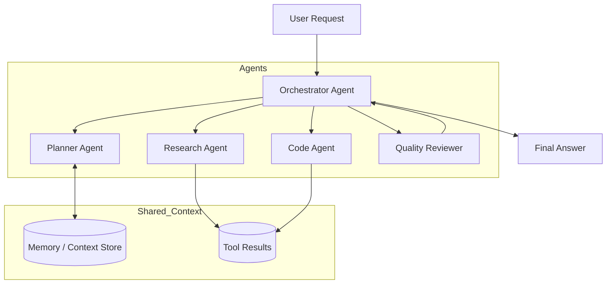

# Flowchart Designer

## Overview

Transform natural language descriptions into clear Markdown plus Mermaid diagrams. Select the diagram type and structure that best fits the described target, especially when the target is a multi-agent system, project workflow, business process, system pipeline, or ambiguous prose requirement.

## Core Workflow

1. Identify the target being visualized:
   - Multi-agent system or agent orchestration
   - Project or delivery workflow
   - Business or operational process
   - System architecture or data pipeline
   - Decision tree, troubleshooting flow, or state transition
   - Mixed or ambiguous process description

2. Extract the entities and relationships:
   - Actors, agents, tools, services, users, systems, queues, databases, artifacts, approvals, and outputs
   - Triggers, handoffs, dependencies, feedback loops, branches, retries, fallbacks, and termination conditions
   - Responsibilities of each participant when the description implies roles

3. Choose the Mermaid diagram style:
   - Use `flowchart TD` for most workflows, agent orchestration, process maps, and pipelines.
   - Use `sequenceDiagram` when the important part is message exchange over time.
   - Use `stateDiagram-v2` when the target is lifecycle, status transitions, or modes.
   - Use `graph LR` when the target is architecture-like and left-to-right readability is better.
   - Use `journey` only for user journey requests.

4. Build the diagram from the user’s intent rather than a fixed template. Do not force start/end nodes unless they improve accuracy. Preserve the natural shape of the described system or project.

5. After the diagram, add a short explanation and, when useful, an assumptions section. Keep assumptions explicit and separate from the diagram.

## Output Format

Return Markdown with this flexible structure:

```markdown
# [descriptive title]

[one-sentence summary of what the diagram shows]

```mermaid
[Mermaid diagram]
```

## Notes
n- [brief explanation of important flows, branches, or responsibilities]

## Assumptions
- [only include when the source text is incomplete or ambiguous]
```

Do not include sections that add no value. Keep the diagram first unless the user asks for analysis before the diagram.

## Multi-Agent System Guidance

For multi-agent systems, prefer showing orchestration, responsibilities, tool use, memory/context flow, guardrails, and result synthesis. Common nodes include user request, router/planner, specialist agents, tools, shared memory, evaluator/critic, human approval, final response, retry loop, and error handling.

Use subgraphs to group agents or layers when it helps readability:



When the prompt says something like “为当前的多agents系统绘制流程图”, infer a reasonable agent-system flow from the available description. If no concrete details are provided, produce a generic but clearly labeled reference architecture and state that the diagram is based on common multi-agent orchestration assumptions.

## Project and Workflow Guidance

For project or natural-language process requests, detect phases, deliverables, reviews, decision points, and feedback loops. Use neutral labels that match the user’s domain. When the prose is under-specified, avoid inventing excessive details; add only minimal nodes needed for coherence and list assumptions afterward.

Good project-flow nodes often include requirement intake, clarification, design, implementation, review, test/verification, release, monitoring, and iteration. Use decision diamonds for real decision points only, not for every step.

## Mermaid Quality Rules

- Prefer concise node labels. Use full meaning, not cryptic abbreviations.
- Use stable ASCII node IDs such as `A`, `router`, `agent_research`, or `review_1`; labels may be Chinese or English.
- Quote labels when they contain special characters.
- Avoid unsupported Mermaid syntax.
- Keep diagrams readable; split into multiple diagrams when one graph becomes too dense.
- Preserve domain vocabulary from the user’s text.
- Make feedback loops visually explicit when they are central.
- Use subgraphs for roles, agents, systems, or phases when grouping improves comprehension.
- Do not claim exact architecture when the prompt provides only a high-level request.

## Handling Ambiguity

If the user gives a very short request, produce a useful first diagram with explicit assumptions instead of asking many clarifying questions. Ask a follow-up only when the missing detail would fundamentally change the diagram.

If there are multiple plausible diagram types, choose the one most likely to help and mention that an alternate sequence/state diagram can also be produced.

## Examples

### Example: Multi-agent system

Input: “为当前的多agents系统绘制流程图”

Output should use Markdown plus Mermaid, likely `flowchart TD`, with an orchestrator, planner, specialized agents, tools/context, reviewer/evaluator, retry or refinement loop, and final response. Add assumptions if the current system is not explicitly described.

### Example: Natural-language project flow

Input: “根据用户反馈生成缺陷分析报告，并交给质检人员确认后同步给研发修复。”

Output should show feedback intake, defect classification, report generation, quality confirmation, decision on whether more information is needed, handoff to engineering, fix verification, and closure when appropriate.
