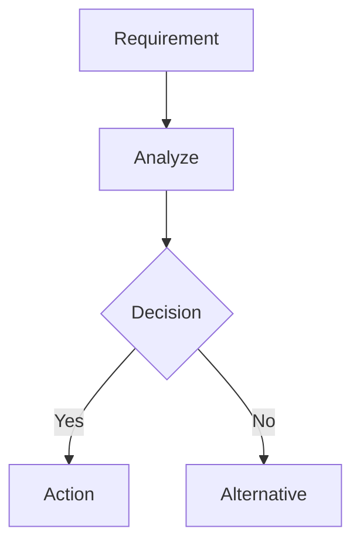
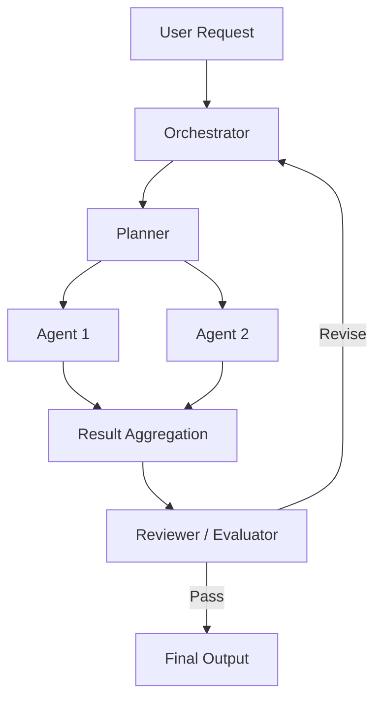
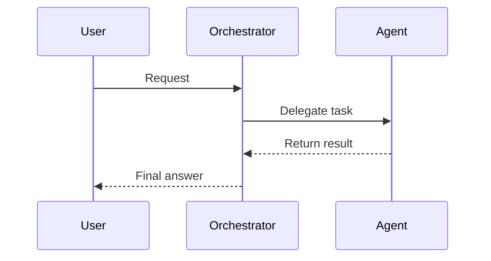
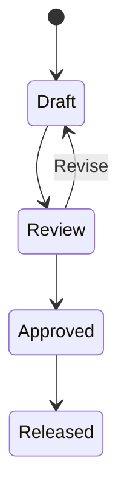

# Mermaid Patterns

## General flowchart

```mermaid
flowchart TD
  A[Requirement] --> B[Analyze]
  B --> C{Decision}
  C -- Yes --> D[Action]
  C -- No --> E[Alternative]
```

## Multi-agent orchestration

```mermaid
flowchart TD
  U[User Request] --> O[Orchestrator]
  O --> P[Planner]
  P --> A1[Agent 1]
  P --> A2[Agent 2]
  A1 --> R[Result Aggregation]
  A2 --> R
  R --> V[Reviewer / Evaluator]
  V -->|Pass| F[Final Output]
  V -->|Revise| O
```

## Sequence diagram

```mermaid
sequenceDiagram
  participant User
  participant Orchestrator
  participant Agent
  User->>Orchestrator: Request
  Orchestrator->>Agent: Delegate task
  Agent-->>Orchestrator: Return result
  Orchestrator-->>User: Final answer
```

## State diagram

```mermaid
stateDiagram-v2
  [*] --> Draft
  Draft --> Review
  Review --> Approved
  Review --> Draft: Revise
  Approved --> Released
```
